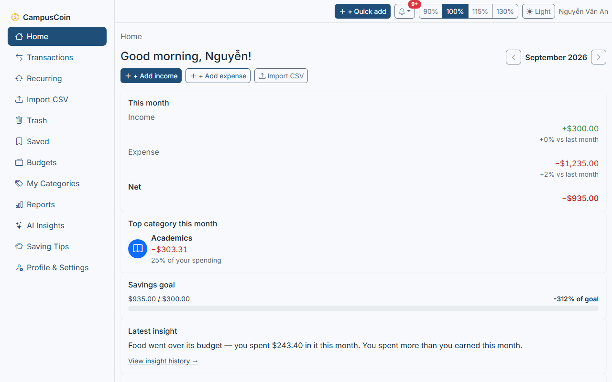
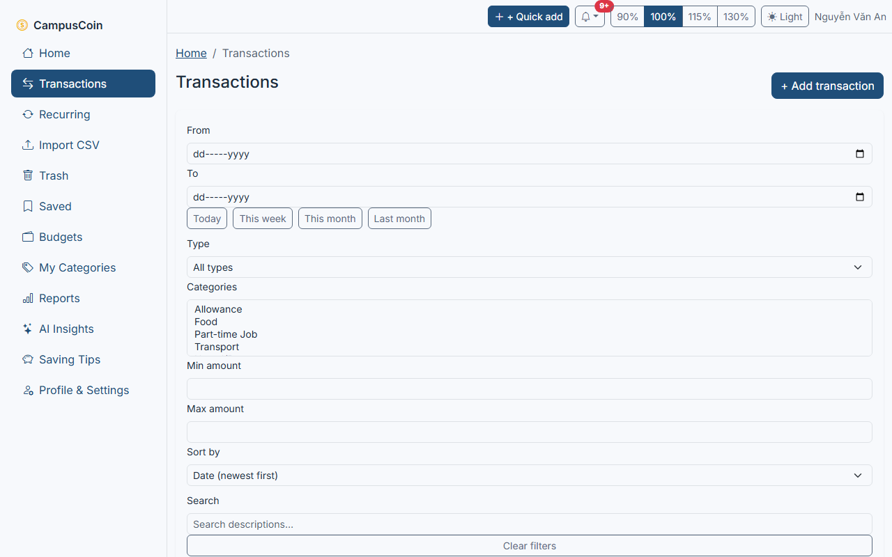
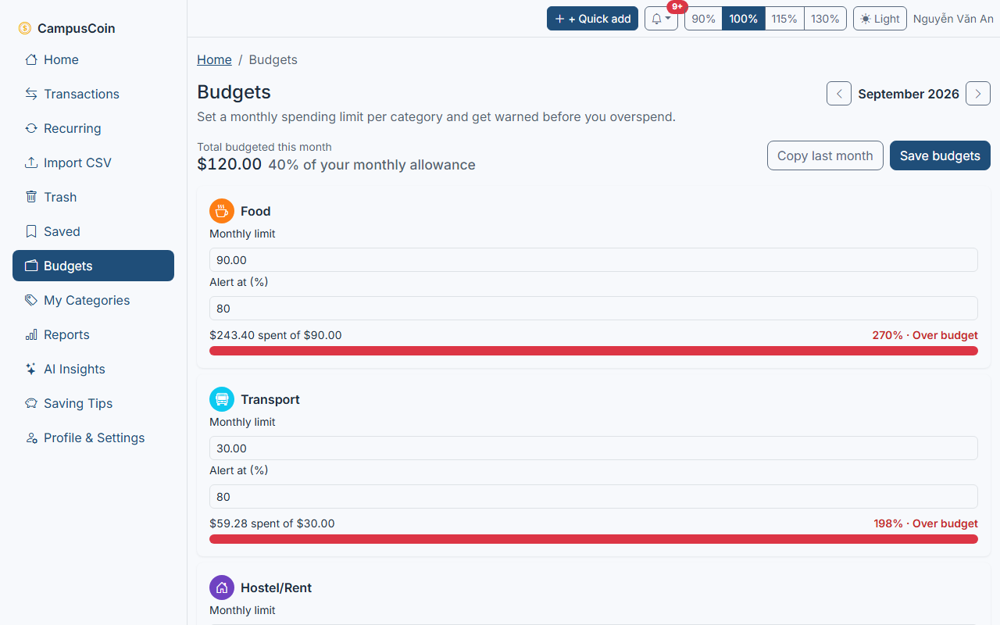
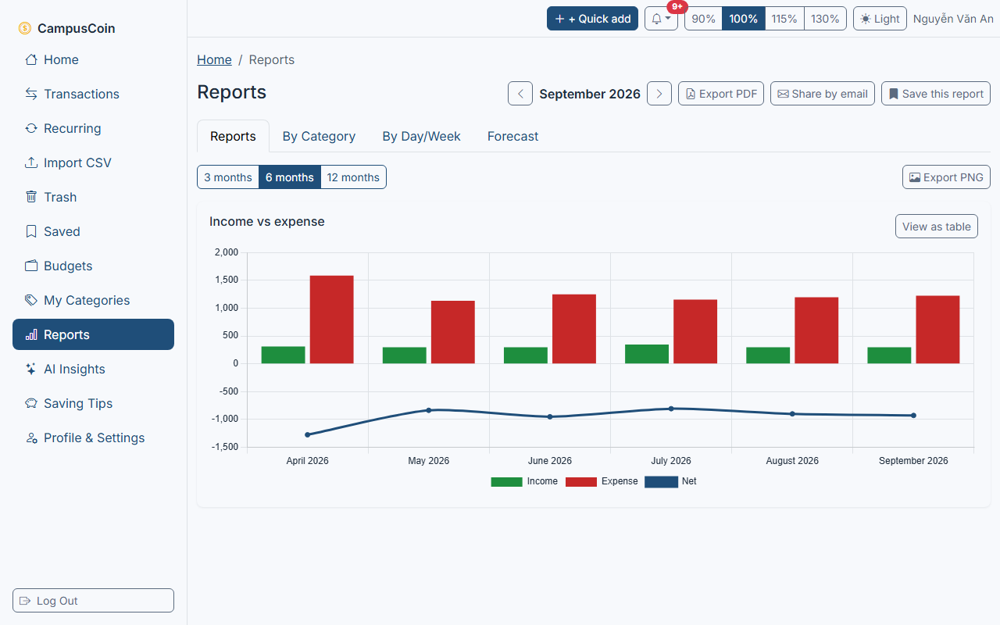
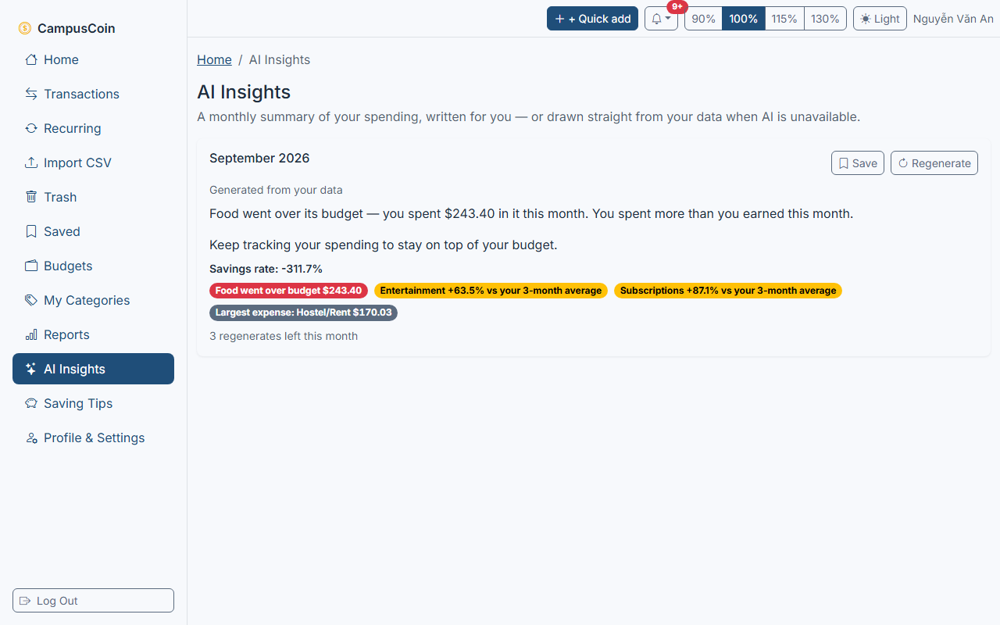
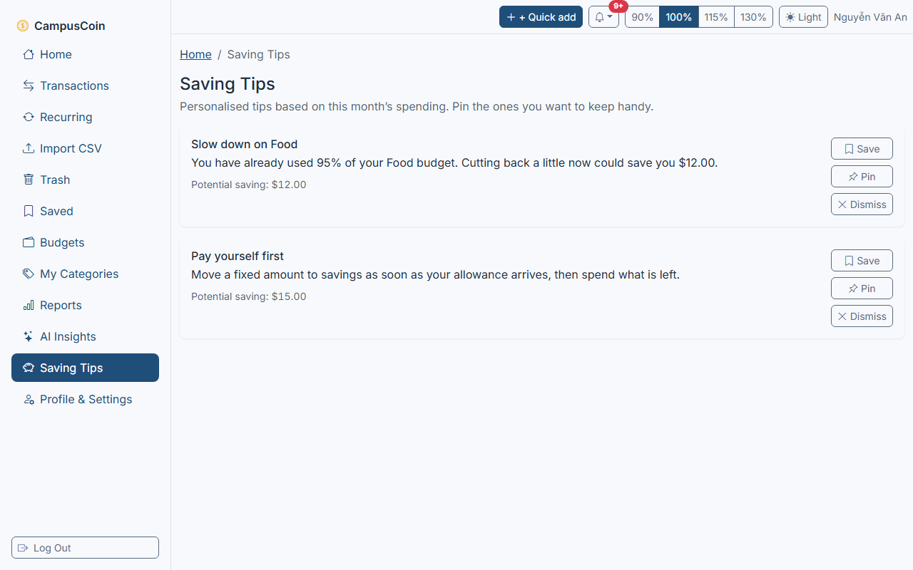
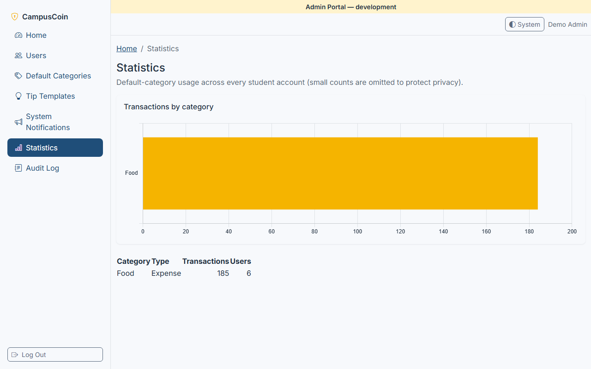

# CampusCoin

> Smart Spending, Student Style – a responsive web app that helps college students track
> income and expenses, set budgets and get AI-assisted insights and saving tips.

Monorepo (npm workspaces): `backend/` (Express 5 API + worker), `frontend/` (React 19 + Vite),
`shared/` (Zod schemas, enums, constants). Full design spec: `docs/spec/`. Build progress and
decision log: `PROGRESS.md`. Requirements traceability: `docs/traceability.md`.

## Features

- **Fast transaction entry** – quick-add modal (≤ 3 actions), AI category auto-fill, keyboard
  shortcut, recurring rules, CSV import wizard, full edit/delete history with undo.
- **AI assistance (optional)** – 3-tier category suggestion (personal rules → keywords → LLM)
  that learns from your corrections, monthly spending insights with growth flags, and a
  personalised saving-tips engine. The app works fully with no AI key configured (rule/keyword
  fallback only).
- **Budgets & alerts** – per-category budgets with progress bars and real-time (SSE) notifications
  at 80% and 100% of budget.
- **Reports** – category breakdown, income vs expense trends, daily/weekly views, PDF/PNG export,
  and share-by-email.
- **Smart activity** – recently viewed/edited transactions, next-month forecast, anomaly and
  duplicate detection.
- **Admin portal** – separate login with mandatory TOTP MFA; manage default categories, tip/
  notification templates, user accounts and view aggregate statistics (never individual
  transactions).
- **Accessibility & UX** – WCAG 2.2 AA target, dark mode, adjustable font size, breadcrumbs,
  onboarding wizard, empty states, support chatbot widget.
- **Privacy controls** – export your data (JSON/CSV) or delete your account with a 30-day grace
  period; see `docs/security/review-p19.md` for the full security posture.

## Screenshots

| | |
|---|---|
|  Landing |  Dashboard |
|  Transactions |  Budgets |
|  Reports |  AI insights |
|  Saving tips |  Admin portal |

More screenshots (login, register) in [`docs/screenshots/`](docs/screenshots/). Regenerate them
against a running dev stack with `npm run screenshots` (Playwright, writes to `docs/screenshots/`).

## Architecture

Three-tier architecture: a React SPA (presentation), an Express API + background worker + AI
adapter (application), and MySQL + Redis (data). See `docs/spec/04-architecture.md` for the full
component-responsibility table.

| Diagram | |
|---|---|
| Overall 3-tier architecture | `docs/diagrams/fig05.jpg` |
| Backend layers & modules | `docs/diagrams/fig06.jpg` |
| Frontend component architecture | `docs/diagrams/fig07.jpg` |
| Deployment (production) | `docs/diagrams/fig08.jpg` |

| Component | Responsibility |
|---|---|
| React SPA | Rendering, client-side validation, UI state, charts. Talks to `/api/v1` over HTTPS JSON, SSE for notifications. |
| Nginx (prod) | TLS termination, static asset caching, reverse proxy, body-size/rate limiting, round-robin across 2 API instances. |
| Express API | AuthN/AuthZ, business logic, data access via Prisma, publishes domain events. |
| Worker | BullMQ consumer: recurring transactions, monthly insights, email, CSV import, cleanup jobs. |
| AI Adapter | Provider-agnostic interface to the LLM (Gemini/OpenAI), PII scrubbing, caching, timeout + output validation. |
| MySQL 8.4 | System of record, internal network only. |
| Redis 7 | Cache, rate limiting, job queue, pub/sub. |

## Tech stack

- **Backend:** Node.js 24, TypeScript (strict), Express 5, Prisma ORM, MySQL 8.4, Redis 7 (ioredis),
  BullMQ, Zod, argon2, jose (JWT), otplib (TOTP), helmet, express-rate-limit, pino, csv-parse,
  pdfmake, nodemailer, `@asteasolutions/zod-to-openapi` + Swagger UI, Vitest + Supertest.
- **Frontend:** React 19 + TypeScript, Vite, Bootstrap 5.3 + React-Bootstrap + SCSS, React Router
  v7, TanStack Query v5, React Hook Form + Zod, axios, Chart.js 4, html-to-image, Vitest + React
  Testing Library, Playwright + axe-core.
- **Shared:** `shared/` – Zod schemas, enums, DTO types and constants used by both apps.
- **Infra:** Docker Compose (dev: MySQL, Redis, Mailpit; prod: `docker-compose.prod.yml` – Nginx,
  2× API, worker, MySQL, Redis), GitHub Actions CI/CD, Sentry (optional, no-op unless a DSN is set).
- **AI:** provider-agnostic adapter, default Google Gemini Flash, alt OpenAI; runs fully without
  an API key (rule/keyword fallback).

## Requirements

- Windows 10/11 (PowerShell), macOS or Linux
- Node.js **24 LTS** or newer, npm 11+
- Docker Desktop (for MySQL 8.4, Redis 7, Mailpit)

## Getting started (PowerShell)

```powershell
# 1. Install dependencies (also builds the shared package)
npm install

# 2. Create your local config, then generate secrets and paste them into .env
Copy-Item .env.example .env
npm run keys:generate

# 3. Start MySQL, Redis and Mailpit (wait until all three are "healthy")
docker compose up -d
docker compose ps

# 4. Start API + web in watch mode
npm run dev
```

- Web: http://localhost:5174 (`WEB_PORT`)
- API: http://localhost:3000 (`API_PORT`) – check with `curl.exe http://localhost:3000/api/v1/health/live`
- API docs (Swagger UI, dev/staging only): http://localhost:3000/api/v1/docs
- Mail inbox (Mailpit): http://localhost:8025

For the full install guide (Docker / manual / production, PowerShell + bash), see
[`docs/INSTALL.md`](docs/INSTALL.md).

### Port already in use?

If MySQL/XAMPP or another project already uses a port on Windows, change it in `.env`.
The web dev server never jumps to another port by itself: if `WEB_PORT` is taken it stops
with "Port … is already in use"; the API prints a similar message for `API_PORT`.

| What                   | Variable(s) to change                                                          |
| ---------------------- | -------------------------------------------------------------------------------- |
| MySQL host port (3306) | `MYSQL_HOST_PORT` **and** the port in `DATABASE_URL` / `DATABASE_MIGRATOR_URL` |
| Redis host port (6379) | `REDIS_HOST_PORT` **and** the port in `REDIS_URL`                              |
| API port (3000)        | `API_PORT` **and** `API_URL` (the Vite `/api` proxy follows `API_PORT`)        |
| Web port (5174)        | `WEB_PORT` **and** `APP_URL`, `CORS_ORIGINS` (Playwright follows `WEB_PORT`)   |

One-off override without editing `.env` (PowerShell):

```powershell
$env:WEB_PORT = '5175'; $env:APP_URL = 'http://localhost:5175'; npm run dev
```

The MySQL users are created only on the first start of an empty volume
(`database/create_users.sql`). To recreate the database from scratch:
`docker compose down -v` then `docker compose up -d` (this **deletes** all local data).

## Environment variables

Every variable is documented inline in [`.env.example`](.env.example) (copy it to `.env`, never
commit `.env`). Categories:

| Category | Variables | Purpose |
| --- | --- | --- |
| Docker / app | `MYSQL_HOST_PORT`, `REDIS_HOST_PORT`, `NODE_ENV`, `API_PORT`, `WEB_PORT`, `APP_URL`, `API_URL`, `CORS_ORIGINS`, `LOG_LEVEL` | Local ports, public URLs, CORS allowlist, logging |
| Database | `DATABASE_URL`, `DATABASE_MIGRATOR_URL` | App vs migration DB accounts (least privilege) |
| Redis | `REDIS_URL` | Cache, rate limiting, queues |
| Auth | `JWT_PRIVATE_KEY`, `JWT_PUBLIC_KEY`, `JWT_KID`, `ACCESS_TOKEN_TTL`, `REFRESH_TOKEN_TTL`, `IP_HASH_SECRET`, `HIBP_ENABLED`, `ADMIN_EMAIL`, `ADMIN_PASSWORD` | Token signing/lifetimes, password breach check, first-admin bootstrap |
| Encryption | `DATA_ENCRYPTION_KEY`, `DATA_ENCRYPTION_KEY_VERSION` | AES-256-GCM for sensitive fields |
| Email | `SMTP_HOST`, `SMTP_PORT`, `SMTP_USER`, `SMTP_PASS`, `MAIL_FROM`, `SUPPORT_EMAIL` | Verification/reset/share emails (dev: Mailpit) |
| AI | `AI_PROVIDER`, `AI_API_KEY`, `AI_MODEL`, `AI_TIMEOUT_MS`, `AI_DAILY_QUOTA` | LLM adapter config; empty key = rule/keyword-only mode |
| Monitoring | `SENTRY_DSN`, `SENTRY_ENV` | Optional error tracking (no-op unless set) |
| Privacy | `AUDIT_ARCHIVE_DIR` | Where the cleanup job archives audit logs older than 12 months |
| Frontend (build-time, no secrets) | `VITE_API_URL`, `VITE_TAWK_PROPERTY_ID`, `VITE_TAWK_WIDGET_ID`, `VITE_SENTRY_DSN` | API base URL, chatbot widget, optional error tracking |

`npm run keys:generate` prints a fresh JWT Ed25519 key pair, `DATA_ENCRYPTION_KEY` and
`IP_HASH_SECRET` ready to paste into `.env`.

## Scripts

| Command                             | What it does                                                       |
| ------------------------------------ | -------------------------------------------------------------------- |
| `npm run dev`                       | shared (tsc watch) + API (tsx watch) + web (Vite) in parallel      |
| `npm run worker -w backend`         | background worker (recurring transactions, insights, email, cleanup) |
| `npm run lint` / `npm run lint:fix` | ESLint for the whole repo                                          |
| `npm run typecheck`                 | TypeScript strict check of all packages                            |
| `npm test`                          | Vitest unit/integration tests (backend + frontend)                 |
| `npm run test:e2e`                  | Playwright E2E (first time: `npx playwright install chromium firefox webkit`) |
| `npm run test:all`                  | lint → typecheck → unit+integration → E2E, in one shot             |
| `npm run format`                    | Prettier                                                            |
| `npm run build`                     | production build of all packages                                   |
| `npm run keys:generate`             | print JWT Ed25519 key pair, data-encryption key and IP-hash secret |
| `npm run admin:create -w backend`   | create the admin account from `ADMIN_EMAIL`/`ADMIN_PASSWORD` (idempotent) |
| `npm run ai:eval -w backend`        | categorization quality report against the fixture dataset (works with no AI key) |
| `npm run db:migrate -w backend`     | apply Prisma migrations (dev)                                      |
| `npm run db:seed -w backend -- --demo` | seed default categories/tips + 5 demo accounts with sample data |
| `npm run db:export -w backend`      | regenerate `database/campus_coin_schema.sql` and `database/seed.sql` from the live DB |
| `npm run docs:openapi -w backend`   | regenerate `docs/openapi.yaml` from the Zod schemas                |
| `npm run screenshots`               | regenerate `docs/screenshots/*.png` via Playwright                 |
| `npm run package:submission`        | assemble the `submission/` folder (source, DB exports, docs, samples) |
| `npm run docker:prod:up`            | build and start the production Docker Compose stack                |

## Demo accounts

`npm run db:seed -w backend -- --demo` populates the demo accounts below (refuses to run when
`NODE_ENV=production`) and prints the demo admin's TOTP otpauth URL + a currently-valid 6-digit
code to the console, so an examiner can log in immediately without scanning a QR code.

| Role | Email | Password | Notes |
|---|---|---|---|
| Admin | admin@campuscoin.demo | Admin@Campus2026! | Login at `/admin/login`; demo TOTP code printed to the console on seed |
| Student 1 | an.nguyen@campuscoin.demo | Student@Campus2026! | 6 months of data, AI on, has budgets and a generated insight/tips |
| Student 2 | binh.tran@campuscoin.demo | Student@Campus2026! | 3 months of data, AI off, has 4 recurring subscriptions and a last-month spending spike |
| Student 3 | chi.le@campuscoin.demo | Student@Campus2026! | Brand new account, for onboarding/CSV-import demos |
| Disabled student | disabled@campuscoin.demo | Student@Campus2026! | Status disabled — demonstrates a login failure |

Sample CSV files for the import wizard live in `docs/samples/` (see `docs/samples/README.md`).

## Testing

- **Unit + integration:** Vitest + Supertest, `npm test` (backend + frontend workspaces).
  Coverage thresholds (≥80% statements/branches/functions/lines) enforced on
  `backend/src/modules/**` and the pure calculation libs.
- **End-to-end:** Playwright, `npm run test:e2e` — 15 numbered scenario specs + an accessibility
  sweep (7 pages × light/dark, axe-core, 0 serious/critical) + a security spec. Chromium runs the
  full suite; Firefox/WebKit run a curated critical-path subset; a 375px mobile-Chromium project
  covers responsive/dark-mode/font-scale checks. See `docs/testing/tc-matrix.md` for the TC-01..28
  test-case mapping and `docs/traceability.md` for full requirement-to-test traceability.
- **Security:** dedicated security-review pass, findings and fixes in `docs/security/review-p19.md`.
- **Performance:** k6 load-test scripts in `perf/` (`docs/perf.md`).

## API documentation

The full OpenAPI 3.1 spec is generated from the same Zod schemas the API validates against:
`docs/openapi.yaml` (regenerate with `npm run docs:openapi -w backend`). Browse it interactively
via Swagger UI at `/api/v1/docs` when running in a non-production environment.

## Documentation index

| Doc | Contents |
|---|---|
| [`docs/spec/`](docs/spec/) | Full technical design spec (Vietnamese), start at `docs/spec/README.md` |
| [`docs/INSTALL.md`](docs/INSTALL.md) | Docker / manual / production install guide (PowerShell + bash) |
| [`docs/traceability.md`](docs/traceability.md) | Requirement → API → DB table → test traceability matrix |
| [`docs/openapi.yaml`](docs/openapi.yaml) | OpenAPI 3.1 API contract |
| [`docs/deploy.md`](docs/deploy.md) | Production deployment runbook |
| [`docs/perf.md`](docs/perf.md) | Performance budgets and k6 load-test results |
| [`docs/security/review-p19.md`](docs/security/review-p19.md) | Security review findings and fixes |
| [`docs/testing/tc-matrix.md`](docs/testing/tc-matrix.md) | Test-case → automated-test mapping |
| [`docs/AI-DECLARATION.md`](docs/AI-DECLARATION.md) | Declaration of AI tools used to build and run this project |
| [`CHANGELOG.md`](CHANGELOG.md) | Phase-by-phase change history |
| [`PROGRESS.md`](PROGRESS.md) | Build log, decisions and known issues |

## Deployment

Production runs behind Nginx with 2 API replicas, a worker, MySQL and Redis, all defined in
`docker-compose.prod.yml` and built via `backend/Dockerfile`/`frontend/Dockerfile` (multi-stage,
non-root). CI/CD is GitHub Actions (`.github/workflows/ci.yml`, `deploy.yml`). Full runbook —
VPS hardening, DNS/TLS via Cloudflare, secrets, backup/restore, monitoring — in
[`docs/deploy.md`](docs/deploy.md).

## Security

CampusCoin follows the design in `docs/spec/09-security.md` and was audited in a dedicated
security-hardening phase (findings and fixes: `docs/security/review-p19.md`). Highlights:

- **Passwords & tokens**: Argon2id password hashing, a common-password + HIBP check, access
  tokens are short-lived EdDSA JWTs kept in memory only (never `localStorage`), refresh tokens
  are single-use and rotate on every use with whole-session-family revocation on reuse, stored
  only as a `HttpOnly`/`Secure`/`SameSite=Strict` cookie.
- **Admin access**: separate login + mandatory TOTP MFA, enrolled once out-of-band at account
  creation (never over the login response), with one-time recovery codes and an escalating
  lockout on repeated failures.
- **Authorization & data isolation**: every query on a student's own data is scoped by the
  user id from their verified token at the repository layer; a request for another user's
  resource returns 404, never 403. Every request body/query is validated and field-whitelisted
  with Zod — a client can never set its own `role`, `status`, `userId` or similar.
- **Abuse protection**: per-route and per-account rate limiting (including IPv6-safe keys and a
  separate cap for password-spraying across accounts), account lockout with shadow-lockout for
  unregistered emails (so login attempts never reveal which emails are registered), and a cap on
  concurrent CSV import batches per user.
- **Transport & headers**: CORS restricted to an explicit origin allowlist, CSRF protection on
  cookie-authenticated endpoints (Origin + custom-header check), a helmet-based security-header
  set (CSP, HSTS, frame/referrer/permissions policy) on every API response, and TLS required for
  outbound email in production.
- **Output & error handling**: all errors follow RFC 9457 `application/problem+json` and never
  leak internal detail (ORM error codes, stack traces); logs redact passwords, tokens, cookies
  and other secrets; user- and AI-generated text is always rendered as plain text by React, never
  as HTML.
- **Dependencies**: `npm audit` reports 0 known vulnerabilities (checked in CI-equivalent runs;
  see `docs/security/review-p19.md` for the dependency fixes applied).

Found a security issue? Please report it privately rather than opening a public issue.

## License

This is an academic capstone project (SRS "Campus Coin – Smart Spending, Student Style",
NextGen BudgetBee theme). No open-source license has been granted; all rights are reserved by
the project team for evaluation purposes. AI tools used to build this project are declared in
[`docs/AI-DECLARATION.md`](docs/AI-DECLARATION.md).
