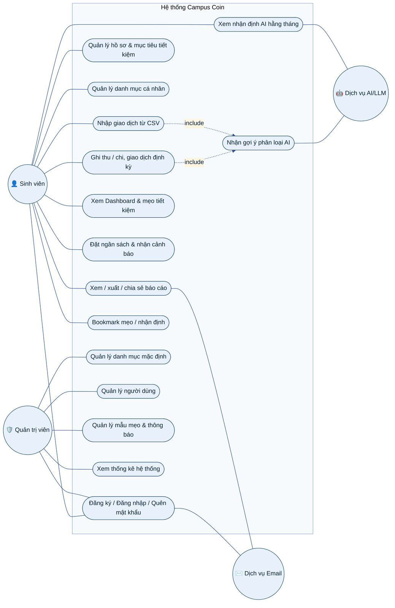
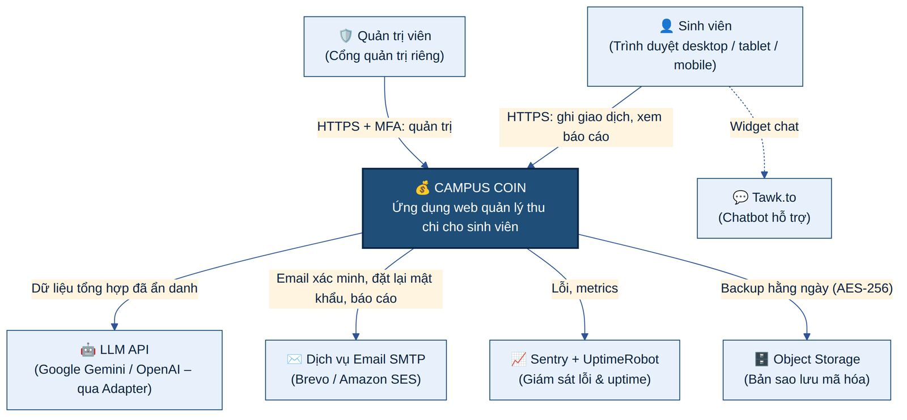
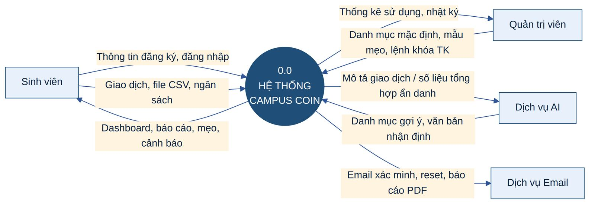
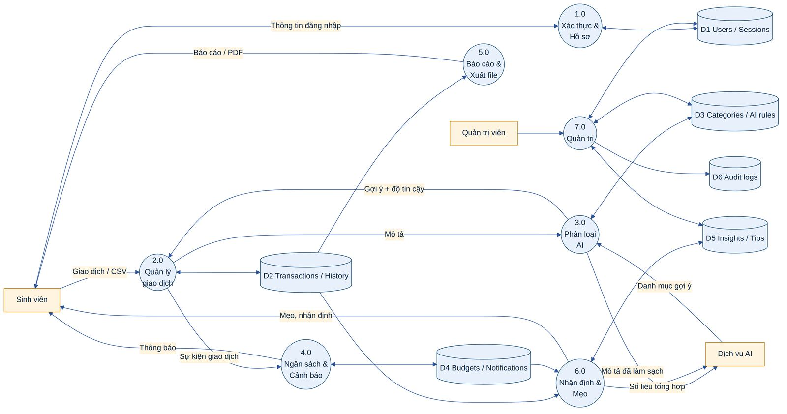

# 1. GIỚI THIỆU

## 1.1 Mục đích tài liệu

Tài liệu Thiết kế Kỹ thuật (Technical Design Document – TDD) này chuyển hóa các yêu cầu trong tài liệu Đặc tả Yêu cầu Phần mềm (SRS) **Campus Coin – Smart Spending, Student Style** (Theme: NextGen BudgetBee, Category: End-to-End Web Solutions, phiên bản 1.0) thành một bản thiết kế có thể triển khai trực tiếp. Tài liệu mô tả kiến trúc hệ thống, lựa chọn công nghệ, thiết kế chức năng chi tiết, thiết kế cơ sở dữ liệu, hợp đồng API, thiết kế giao diện, các biện pháp bảo mật và an toàn dữ liệu, chiến lược kiểm thử, triển khai và vận hành.

Tài liệu là căn cứ thống nhất cho đội phát triển (frontend, backend, QA, DevOps) khi xây dựng sản phẩm, đồng thời là tài liệu giải trình thiết kế trước hội đồng đánh giá. Theo yêu cầu của SRS (mục 1.9), tài liệu **không chứa mã nguồn**; mọi thiết kế được trình bày bằng sơ đồ, bảng và mô tả.

## 1.2 Phạm vi hệ thống

Campus Coin là ứng dụng web full-stack, responsive, giúp sinh viên cao đẳng/đại học ghi nhận thu nhập và chi tiêu, phân loại chi tiêu theo danh mục, đặt ngân sách, theo dõi xu hướng và nhận mẹo tiết kiệm cá nhân hóa. Phạm vi thiết kế bao gồm:

- **Trong phạm vi:** đăng ký/đăng nhập, quản lý phiên, khôi phục mật khẩu; hồ sơ người dùng; quản lý danh mục; ghi nhận thu/chi (kể cả giao dịch định kỳ và nhập CSV); trợ lý phân loại AI; dashboard; báo cáo và xuất PDF/ảnh; nhận định AI hằng tháng; engine mẹo tiết kiệm; ngân sách và cảnh báo; bookmark, ghi chú, chia sẻ qua email; cổng quản trị; tính năng trí tuệ hệ thống (giao dịch gần đây, dự báo, phát hiện bất thường/trùng lặp); khả năng tiếp cận (dark mode, cỡ chữ, breadcrumbs); chatbot hỗ trợ; sitemap.

- **Ngoài phạm vi (theo SRS 1.5):** tích hợp ngân hàng thật, xác minh tài khoản ngân hàng, xử lý thanh toán hoặc giao dịch tiền thật. Mọi gợi ý AI chỉ mang tính tham khảo, không phải tư vấn tài chính được chứng nhận.

## 1.3 Đối tượng sử dụng tài liệu

***Bảng 1: Đối tượng sử dụng tài liệu***

| **Đối tượng**              | **Mục đích sử dụng**                           | **Các chương cần đọc**         |
|----------------------------|------------------------------------------------|--------------------------------|
| Trưởng nhóm / Kiến trúc sư | Nắm kiến trúc, quyết định công nghệ, rủi ro    | Toàn bộ, trọng tâm 3, 4, 9, 10 |
| Lập trình viên Backend     | Hiện thực API, nghiệp vụ, CSDL, job nền        | 4, 5, 6, 7, 9                  |
| Lập trình viên Frontend    | Hiện thực giao diện, luồng người dùng, gọi API | 5, 7, 8                        |
| Kiểm thử viên (QA)         | Thiết kế kịch bản kiểm thử, dữ liệu kiểm thử   | 5, 7, 12, Phụ lục A            |
| DevOps                     | Hạ tầng, CI/CD, sao lưu, giám sát              | 4.4, 9.13, 10, 11              |
| Hội đồng đánh giá          | Đánh giá mức độ đáp ứng SRS                    | 2, 3, 9, Phụ lục A, B          |

## 1.4 Thuật ngữ và từ viết tắt

***Bảng 2: Thuật ngữ và từ viết tắt***

| **Thuật ngữ**                | **Giải thích**                                                                                  |
|------------------------------|-------------------------------------------------------------------------------------------------|
| SRS                          | Software Requirements Specification – Đặc tả yêu cầu phần mềm                                   |
| TDD                          | Technical Design Document – Tài liệu thiết kế kỹ thuật (tài liệu này)                           |
| SPA                          | Single Page Application – ứng dụng web một trang                                                |
| API / REST                   | Giao diện lập trình ứng dụng theo kiến trúc REST, trao đổi JSON qua HTTPS                       |
| JWT                          | JSON Web Token – mã thông báo truy cập có chữ ký số                                             |
| Access token / Refresh token | Token truy cập ngắn hạn (15 phút) / token làm mới dài hạn (7–30 ngày) lưu trong cookie HttpOnly |
| RBAC                         | Role-Based Access Control – phân quyền theo vai trò                                             |
| IDOR                         | Insecure Direct Object Reference – lỗ hổng truy cập đối tượng của người khác qua ID             |
| LLM                          | Large Language Model – mô hình ngôn ngữ lớn dùng cho phân loại và sinh nhận định                |
| PII                          | Personally Identifiable Information – dữ liệu định danh cá nhân                                 |
| SSE                          | Server-Sent Events – kênh đẩy sự kiện một chiều từ máy chủ tới trình duyệt                      |
| ORM                          | Object-Relational Mapping – ánh xạ đối tượng – quan hệ (Prisma)                                 |
| RPO / RTO                    | Recovery Point / Time Objective – lượng dữ liệu tối đa có thể mất / thời gian khôi phục tối đa  |
| Soft delete                  | Xóa mềm: đánh dấu deleted_at thay vì xóa vật lý, cho phép khôi phục                             |
| Merchant key                 | Chuỗi mô tả giao dịch đã chuẩn hóa (chữ thường, bỏ dấu, bỏ số) dùng để học phân loại            |
| Insight                      | Nhận định chi tiêu hằng tháng do AI/engine thống kê sinh ra                                     |
| Tip                          | Mẹo tiết kiệm cá nhân hóa do engine quy tắc sinh ra                                             |

## 1.5 Tài liệu tham chiếu

- SRS Campus Coin – End-to-End Web Solutions, phiên bản 1.0, Aptech Limited.

- OWASP Top 10, OWASP ASVS 4.0 (Application Security Verification Standard) và OWASP Cheat Sheet Series (Password Storage, Session Management, CSRF, File Upload).

- NIST SP 800-63B – Hướng dẫn xác thực số (chính sách mật khẩu).

- WCAG 2.2 mức AA – Hướng dẫn khả năng tiếp cận nội dung web.

- RFC 9457 (Problem Details for HTTP APIs), RFC 6238 (TOTP), RFC 6265 (HTTP Cookies).

## 1.6 Giả định và ràng buộc thiết kế

***Bảng 3: Giả định và ràng buộc***

| **Mã** | **Giả định / Ràng buộc**                                              | **Ảnh hưởng tới thiết kế**                                                        |
|--------|-----------------------------------------------------------------------|-----------------------------------------------------------------------------------|
| C-01   | Không tích hợp ngân hàng; dữ liệu nhập tay hoặc nhập CSV              | Tập trung vào UX nhập nhanh, module import CSV an toàn                            |
| C-02   | Tương thích trình duyệt hiện đại, responsive desktop/tablet/mobile    | Bootstrap 5 grid, mobile-first, kiểm thử đa trình duyệt                           |
| C-03   | AI là tính năng tùy chọn, chỉ mang tính gợi ý                         | Kiến trúc AI dạng adapter, có fallback không dùng AI; người dùng luôn ghi đè được |
| C-04   | Tài liệu dự án không chứa mã nguồn                                    | Mô tả thiết kế bằng sơ đồ và bảng                                                 |
| C-05   | Công nghệ phải nằm trong danh sách gợi ý của SRS 1.8                  | Chọn React + Node.js/Express + MySQL (xem chương 3)                               |
| A-01   | Mỗi người dùng có một đơn vị tiền tệ chính (mặc định USD, hỗ trợ VND) | Lưu currency ở cấp người dùng và giao dịch, không quy đổi tỷ giá                  |
| A-02   | Quy mô ban đầu: ~5.000 người dùng, ~100 giao dịch/người/tháng         | Một VPS + MySQL đơn là đủ; thiết kế sẵn lộ trình mở rộng ngang                    |
| A-03   | Múi giờ mặc định Asia/Ho_Chi_Minh, người dùng tự đổi được             | Lưu thời điểm theo UTC; txn_date là ngày địa phương                               |

# 2. TỔNG QUAN HỆ THỐNG

## 2.1 Bài toán và mục tiêu thiết kế

Sinh viên nhận tiền từ nhiều nguồn không đều đặn (trợ cấp gia đình, việc làm thêm, học bổng, quà tặng) nhưng hiếm khi theo dõi chi tiêu. Các ứng dụng tài chính phổ thông thiết kế cho người đi làm có lương cố định, thường phức tạp hoặc thu phí. Campus Coin giải quyết khoảng trống này với các mục tiêu thiết kế sau:

***Bảng 4: Mục tiêu thiết kế***

| **Mục tiêu**                        | **Chỉ số đo lường**                     | **Giải pháp thiết kế chính**                                          |
|-------------------------------------|-----------------------------------------|-----------------------------------------------------------------------|
| Nhập giao dịch cực nhanh            | ≤ 10 giây / giao dịch; ≤ 3 thao tác     | Quick-add modal, AI tự điền danh mục, phím tắt, nhớ danh mục gần nhất |
| Hiểu chi tiêu tức thì               | Dashboard tải \< 2 giây                 | Truy vấn tổng hợp có chỉ mục + cache Redis, biểu đồ Chart.js          |
| Lời khuyên cá nhân hóa, dễ làm theo | Tỷ lệ tip được pin/bookmark             | Tips engine dựa trên quy tắc + chấm điểm theo tác động tiết kiệm      |
| An toàn dữ liệu tài chính cá nhân   | 0 lỗ hổng mức High theo OWASP ZAP       | Phòng thủ nhiều lớp, phân quyền theo sở hữu, mã hóa, audit log        |
| Sẵn sàng 24/7                       | Uptime ≥ 99,5%                          | 2 bản sao API, health check, backup, giám sát                         |
| Dễ mở rộng                          | Thêm tính năng không phá vỡ module khác | Modular monolith, domain events, hàng đợi job                         |

## 2.2 Các tác nhân của hệ thống

***Bảng 5: Các tác nhân***

| **Tác nhân**            | **Loại**        | **Mô tả và quyền hạn**                                                                                                                                                                                                 |
|-------------------------|-----------------|------------------------------------------------------------------------------------------------------------------------------------------------------------------------------------------------------------------------|
| Khách (Guest)           | Con người       | Xem trang giới thiệu, sitemap, đăng ký, đăng nhập, quên mật khẩu                                                                                                                                                       |
| Sinh viên (Student)     | Con người       | Toàn quyền trên dữ liệu tài chính của chính mình: giao dịch, danh mục riêng, ngân sách, báo cáo, nhận định, mẹo, bookmark, hồ sơ                                                                                       |
| Quản trị viên (Admin)   | Con người       | Đăng nhập qua cổng riêng có MFA; quản lý danh mục mặc định, mẫu mẹo, thông báo hệ thống, tài khoản người dùng (xem, vô hiệu hóa, gửi link reset); xem thống kê tổng hợp. **Không** xem được chi tiết giao dịch cá nhân |
| Dịch vụ AI (LLM API)    | Hệ thống ngoài  | Nhận dữ liệu đã làm sạch/ẩn danh, trả về gợi ý danh mục và văn bản nhận định                                                                                                                                           |
| Dịch vụ Email (SMTP)    | Hệ thống ngoài  | Gửi email xác minh, đặt lại mật khẩu, báo cáo chia sẻ                                                                                                                                                                  |
| Bộ lập lịch (Scheduler) | Hệ thống nội bộ | Kích hoạt giao dịch định kỳ, sinh nhận định hằng tháng, dọn dẹp dữ liệu hết hạn, sao lưu                                                                                                                               |

## 2.3 Sơ đồ Use Case

Sơ đồ dưới đây tổng hợp các ca sử dụng chính theo SRS mục 1.6. Hai ca "Ghi thu/chi" và "Nhập CSV" đều bao hàm (include) ca "Nhận gợi ý phân loại AI".

***Hình 1: Sơ đồ Use Case tổng quát của Campus Coin***

## 2.4 Sơ đồ ngữ cảnh hệ thống

***Hình 2: Sơ đồ ngữ cảnh (System Context)***

Mọi trao đổi với hệ thống ngoài đều qua HTTPS/TLS. Dữ liệu gửi tới LLM được làm sạch PII và tối thiểu hóa; email không chứa đường dẫn công khai tới dữ liệu tài chính; bản sao lưu được mã hóa trước khi rời máy chủ.

## 2.5 Sơ đồ luồng dữ liệu (DFD)

### 2.5.1 DFD mức 0 (mức ngữ cảnh)

***Hình 3: DFD mức 0 – Campus Coin***

### 2.5.2 DFD mức 1

DFD mức 1 phân rã hệ thống thành 7 tiến trình chính và 6 kho dữ liệu. Tiến trình 3.0 (Phân loại AI) và 6.0 (Nhận định & Mẹo) là hai điểm duy nhất gửi dữ liệu ra ngoài tới dịch vụ AI, và cả hai đều đi qua bước làm sạch dữ liệu.

***Bảng 6: Mô tả tiến trình DFD mức 1***

| **Tiến trình**           | **Đầu vào**                           | **Xử lý**                                          | **Đầu ra / Kho dữ liệu**     |
|--------------------------|---------------------------------------|----------------------------------------------------|------------------------------|
| 1.0 Xác thực & Hồ sơ     | Thông tin đăng ký, đăng nhập, hồ sơ   | Xác minh email, băm mật khẩu, cấp/thu hồi token    | D1 Users/Sessions            |
| 2.0 Quản lý giao dịch    | Giao dịch thủ công, định kỳ, CSV      | Validate, lưu, ghi lịch sử, phát sự kiện           | D2 Transactions/History      |
| 3.0 Phân loại AI         | Mô tả giao dịch                       | Luật cá nhân → từ khóa → LLM; học từ sửa đổi       | D3 Categories/AI rules       |
| 4.0 Ngân sách & Cảnh báo | Sự kiện giao dịch, ngân sách          | Tính % tiêu thụ, chống trùng cảnh báo              | D4 Budgets/Notifications     |
| 5.0 Báo cáo & Xuất file  | Bộ lọc thời gian/danh mục             | Tổng hợp, dựng biểu đồ, sinh PDF                   | Báo cáo, file PDF/PNG, email |
| 6.0 Nhận định & Mẹo      | Số liệu tổng hợp, ngân sách, mục tiêu | Thống kê tăng trưởng, chấm điểm tip, gọi LLM       | D5 Insights/Tips             |
| 7.0 Quản trị             | Lệnh của admin                        | CRUD danh mục mặc định, mẫu mẹo, quản lý tài khoản | D1, D3, D5, D6 Audit logs    |

***Hình 4: DFD mức 1 – Phân rã tiến trình và kho dữ liệu***
