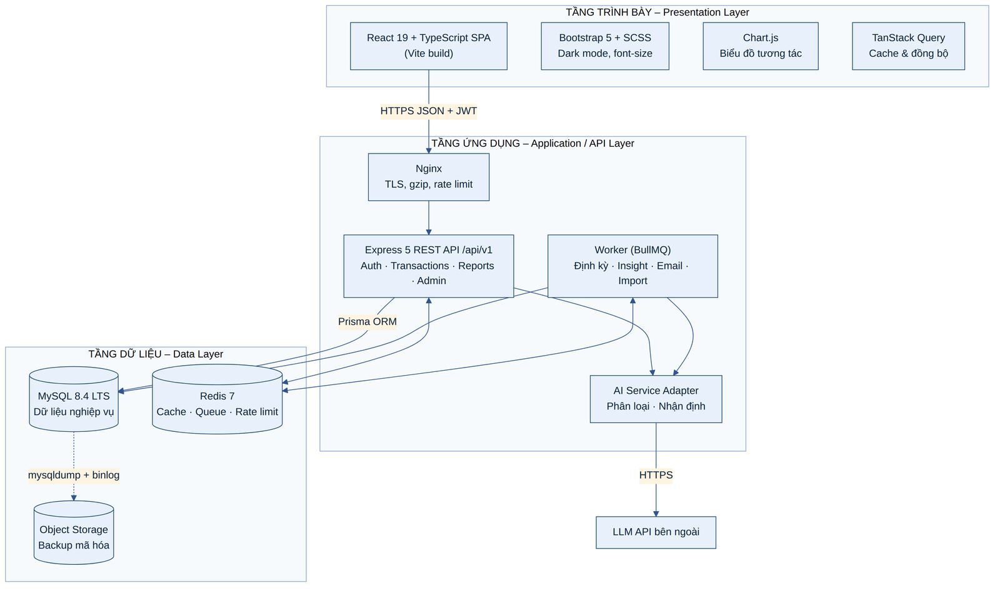
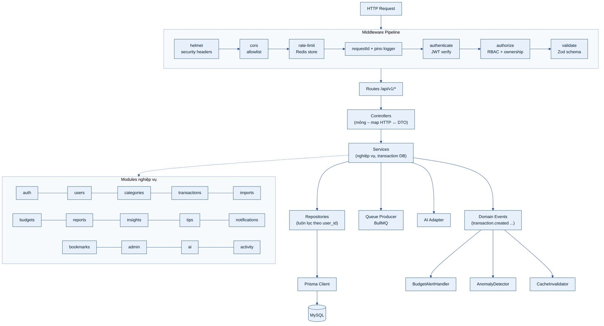
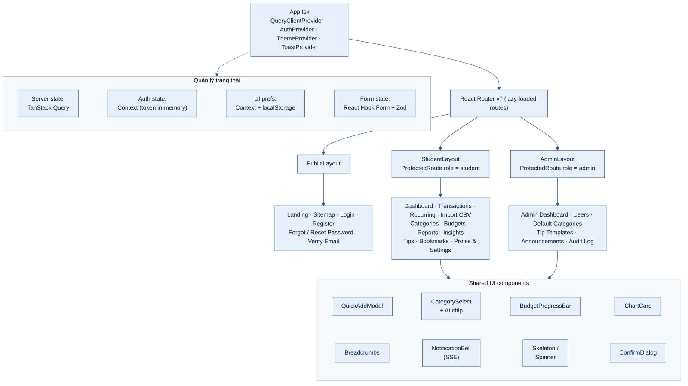
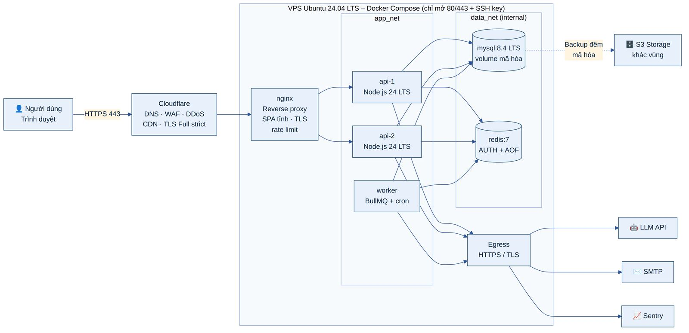

# 4. KIẾN TRÚC HỆ THỐNG

## 4.1 Kiến trúc tổng thể ba tầng

Hệ thống tuân theo kiến trúc ba tầng như SRS mô tả: **Tầng trình bày** (SPA React chạy trên trình duyệt), **Tầng ứng dụng/API** (Nginx, Express API, Worker xử lý nền và AI Adapter) và **Tầng dữ liệu** (MySQL, Redis, kho sao lưu).

***Bảng 10: Trách nhiệm các thành phần***

| **Thành phần** | **Trách nhiệm**                                                                                      | **Giao tiếp**                                          |
|----------------|------------------------------------------------------------------------------------------------------|--------------------------------------------------------|
| React SPA      | Hiển thị, validate phía client, quản lý trạng thái giao diện, vẽ biểu đồ                             | HTTPS JSON tới /api/v1; SSE cho thông báo              |
| Nginx          | Kết thúc TLS, phục vụ file tĩnh (cache dài hạn), reverse proxy, giới hạn kích thước body và tần suất | HTTP nội bộ tới api-1/api-2 (cân bằng tải round-robin) |
| Express API    | Xác thực, phân quyền, nghiệp vụ, truy vấn dữ liệu, phát sự kiện                                      | Prisma → MySQL; ioredis → Redis; BullMQ producer       |
| Worker         | Chạy job nền: giao dịch định kỳ, nhận định tháng, email, import CSV, dọn dẹp                         | BullMQ consumer; MySQL; AI Adapter; SMTP               |
| AI Adapter     | Giao diện thống nhất tới nhà cung cấp LLM, làm sạch PII, cache, timeout, kiểm tra đầu ra             | HTTPS tới LLM API                                      |
| MySQL          | Nguồn dữ liệu chính (source of truth)                                                                | Chỉ nhận kết nối từ mạng nội bộ data_net               |
| Redis          | Cache, rate limit, hàng đợi, pub/sub                                                                 | Chỉ nhận kết nối nội bộ, có mật khẩu                   |

***Hình 5: Kiến trúc tổng thể ba tầng***

## 4.2 Kiến trúc Backend

Backend được tổ chức theo **modular monolith** với các lớp rõ ràng. Mỗi request đi qua chuỗi middleware bảo mật trước khi tới controller (xem sơ đồ cuối mục). Controller chỉ ánh xạ HTTP ↔ DTO; nghiệp vụ nằm ở service; truy cập dữ liệu nằm ở repository và **mọi truy vấn dữ liệu người dùng bắt buộc có điều kiện \`user_id\`** lấy từ token đã xác thực, không bao giờ lấy từ tham số do client gửi.

***Bảng 11: Cấu trúc mã nguồn Backend (mô tả)***

| **Thư mục / Lớp** | **Nội dung**                                                                         | **Quy tắc**                                                                     |
|-------------------|--------------------------------------------------------------------------------------|---------------------------------------------------------------------------------|
| config/           | Đọc và validate biến môi trường khi khởi động                                        | Thiếu biến bắt buộc → dừng khởi động (fail fast)                                |
| middlewares/      | helmet, cors, rateLimit, requestId, authenticate, authorize, validate, errorHandler  | Thứ tự cố định như sơ đồ kiến trúc Backend                                      |
| modules/\<tên\>/  | routes, controller, service, repository, schema (Zod), types cho từng module         | Module không truy cập trực tiếp repository của module khác, chỉ gọi qua service |
| events/           | Event bus nội bộ và các handler (BudgetAlert, Anomaly, CacheInvalidator, AiLearning) | Handler idempotent, lỗi handler không làm hỏng request chính                    |
| jobs/             | Định nghĩa queue, processor, lịch chạy                                               | Mỗi job có retry, timeout, khóa idempotency                                     |
| integrations/     | AI Adapter, Mailer, PDF renderer                                                     | Mọi lời gọi ra ngoài có timeout và circuit breaker                              |
| prisma/           | Schema, migration, seed                                                              | Migration chỉ tiến (forward-only), review trước khi merge                       |
| tests/            | Unit, integration, fixture dữ liệu                                                   | Chạy trong CI với MySQL service container                                       |

***Hình 6: Kiến trúc lớp và module của Backend***

## 4.3 Kiến trúc Frontend

Frontend là SPA với ba layout theo vai trò. Route được lazy-load để giảm kích thước bundle ban đầu. Trạng thái máy chủ quản lý bởi TanStack Query; access token chỉ lưu trong bộ nhớ (React Context), không lưu localStorage; tùy chọn giao diện (dark mode, cỡ chữ) lưu localStorage và đồng bộ lên hồ sơ.

- **Axios instance** có interceptor: gắn access token; khi nhận 401 thì gọi /auth/refresh một lần (hàng đợi các request đang chờ), thất bại thì đăng xuất.

- **ProtectedRoute** kiểm tra đăng nhập và vai trò; điều hướng về trang đăng nhập tương ứng (sinh viên / admin).

- **Error Boundary** theo từng layout để lỗi một widget không làm trắng toàn trang; lỗi gửi về Sentry (đã lọc PII).

- **Code splitting:** Chart.js và trang Admin chỉ tải khi cần; ảnh dùng định dạng WebP, lazy loading.

***Hình 7: Kiến trúc thành phần Frontend***

## 4.4 Kiến trúc triển khai

Toàn bộ hệ thống chạy trên một VPS (khuyến nghị 2 vCPU, 4 GB RAM, 80 GB SSD) bằng Docker Compose. Cơ sở dữ liệu và Redis nằm trong mạng Docker internal không mở cổng ra ngoài. Hai bản sao API cho phép cập nhật cuốn chiếu (rolling update) không gián đoạn. Cloudflare đứng trước để ẩn IP gốc, lọc tấn công và cache tài nguyên tĩnh; tường lửa VPS chỉ chấp nhận cổng 443 từ dải IP Cloudflare.

***Bảng 12: Các container triển khai***

| **Container** | **Image**                                  | **Tài nguyên**           | **Ghi chú bảo mật**                                                       |
|---------------|--------------------------------------------|--------------------------|---------------------------------------------------------------------------|
| nginx         | nginx:stable-alpine                        | 0,25 CPU / 128 MB        | Chạy non-root, cấu hình read-only, TLS 1.2+                               |
| api (×2)      | Image nội bộ (node:24-alpine, multi-stage) | 0,5 CPU / 512 MB mỗi bản | User node, filesystem read-only, không cài công cụ build trong image cuối |
| worker        | Cùng image API, lệnh khởi động khác        | 0,5 CPU / 512 MB         | Giới hạn đồng thời job; không expose cổng                                 |
| mysql         | mysql:8.4                                  | 1 CPU / 1,5 GB           | Volume mã hóa, user ứng dụng quyền tối thiểu, không expose cổng           |
| redis         | redis:7-alpine                             | 0,25 CPU / 256 MB        | requirepass, tắt lệnh nguy hiểm (FLUSHALL, CONFIG), AOF                   |

***Hình 8: Sơ đồ triển khai (Deployment)***

## 4.5 Xử lý bất đồng bộ và tác vụ nền

***Bảng 13: Danh sách tác vụ nền***

| **Queue / Job**       | **Kích hoạt**                                  | **Lịch / Độ trễ**       | **Retry**           | **Idempotency**                                                   |
|-----------------------|------------------------------------------------|-------------------------|---------------------|-------------------------------------------------------------------|
| email.send            | Đăng ký, quên mật khẩu, chia sẻ báo cáo        | Ngay lập tức            | 5 lần, backoff mũ   | jobId = mục đích + tokenId                                        |
| recurring.materialize | Scheduler                                      | 00:05 hằng ngày         | 3 lần               | UNIQUE(recurring_rule_id, recurring_period)                       |
| insight.generate      | Scheduler / người dùng nhấn "Tạo lại"          | 00:30 ngày 1 hằng tháng | 3 lần (2s, 8s, 32s) | UNIQUE(user_id, month) – upsert                                   |
| import.parse          | Tải lên CSV                                    | Ngay lập tức            | 1 lần               | UNIQUE(user_id, file_sha256)                                      |
| tips.refresh          | Sự kiện giao dịch (debounce 5 phút/người dùng) | Trễ 5 phút              | 2 lần               | jobId = user + ngày                                               |
| cleanup.expired       | Scheduler                                      | 03:00 hằng ngày         | 3 lần               | Xóa token hết hạn, bản nháp import \> 24h, soft-delete \> 30 ngày |
| backup.database       | Cron hệ điều hành                              | 02:00 hằng ngày         | Cảnh báo nếu lỗi    | Tên file theo ngày                                                |

## 4.6 Cơ chế sự kiện miền (Domain Events)

Sau khi một giao dịch được tạo, sửa, xóa hoặc khôi phục thành công (đã commit DB), service phát sự kiện transaction.created \| updated \| deleted \| restored kèm userId, categoryId, tháng và số tiền. Các handler đăng ký độc lập:

- **BudgetAlertHandler** – tính lại mức tiêu thụ ngân sách và tạo thông báo (mục 5.11).

- **AnomalyDetector** – kiểm tra giao dịch bất thường hoặc trùng lặp (mục 5.14).

- **CacheInvalidator** – xóa cache dashboard/báo cáo của người dùng cho tháng liên quan.

- **AiLearningHandler** – nếu category_source = ai_overridden, cập nhật luật phân loại cá nhân.

- **TipsRefresher** – đưa job làm mới tips (debounce) vào hàng đợi.

Thiết kế này tách nghiệp vụ lõi khỏi tác vụ phụ, giúp dễ kiểm thử và mở rộng; khi cần tách microservice, event bus nội bộ có thể thay bằng Redis Streams mà không đổi handler.
