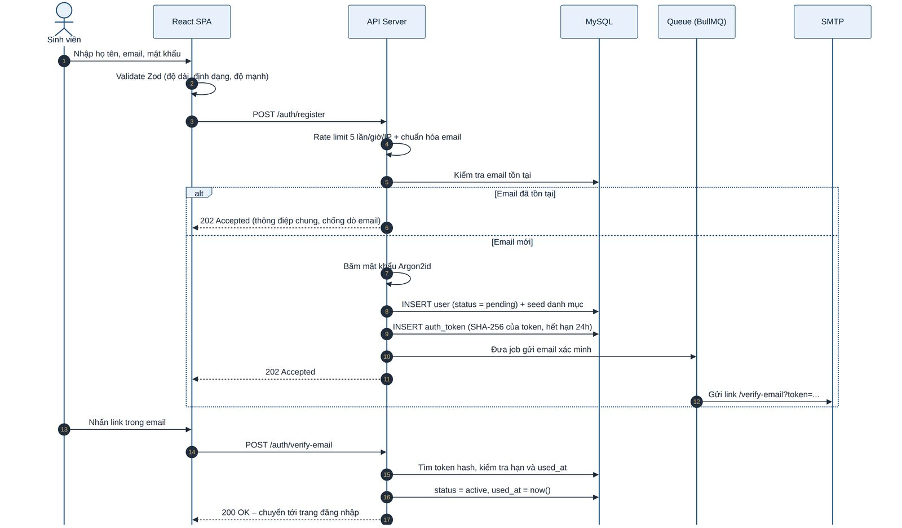
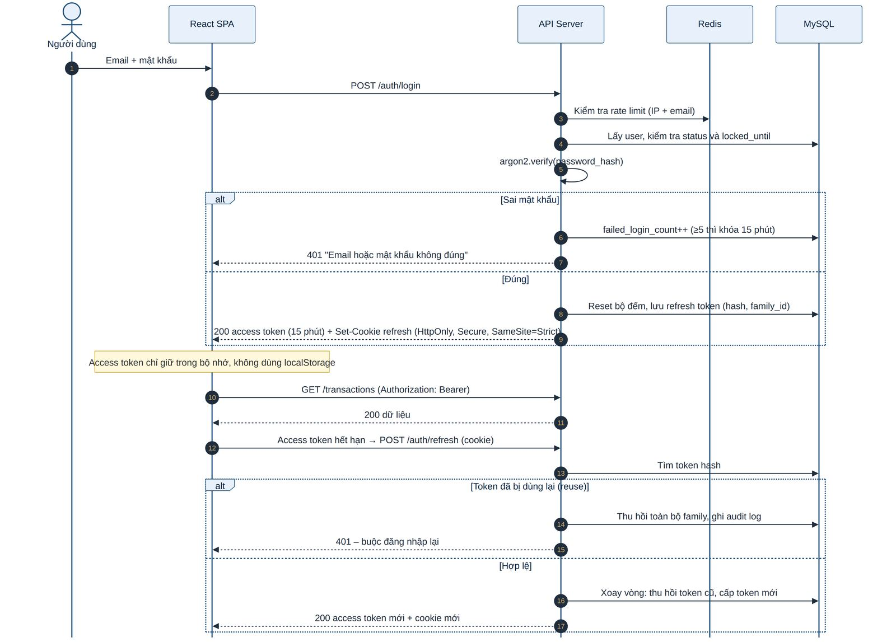
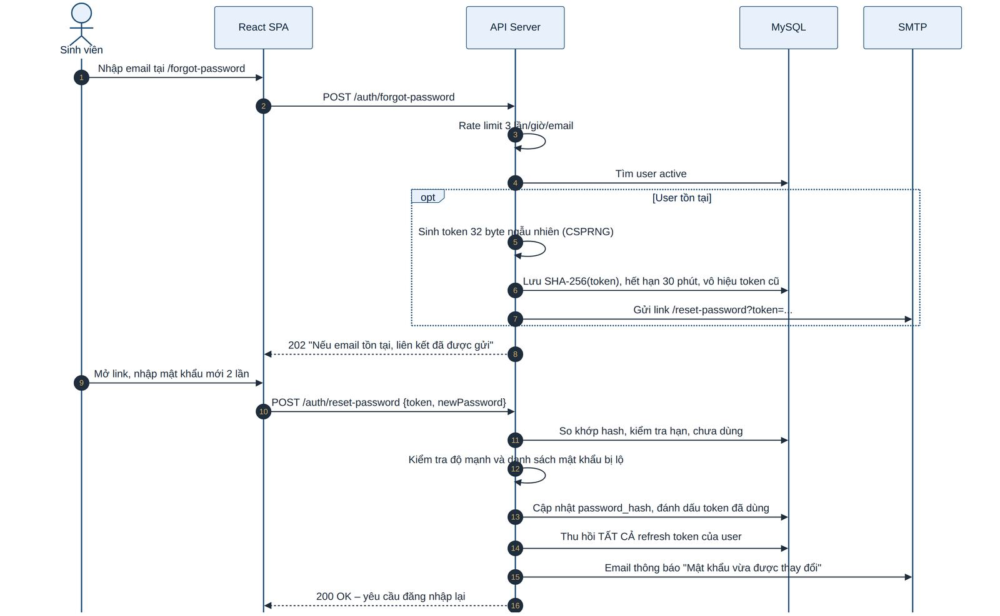
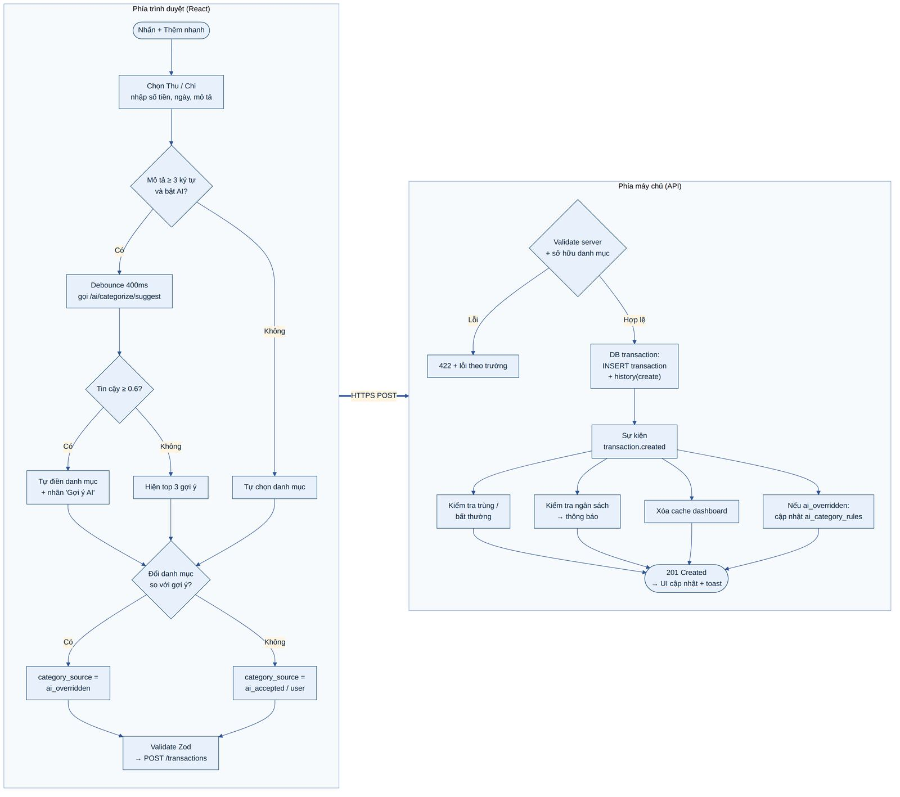
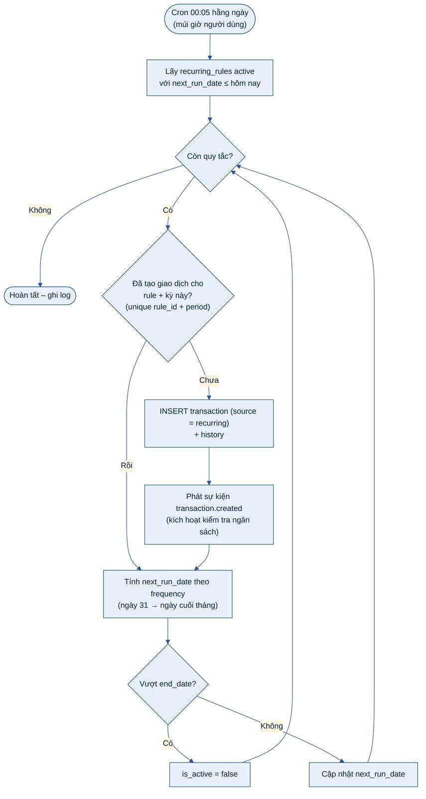
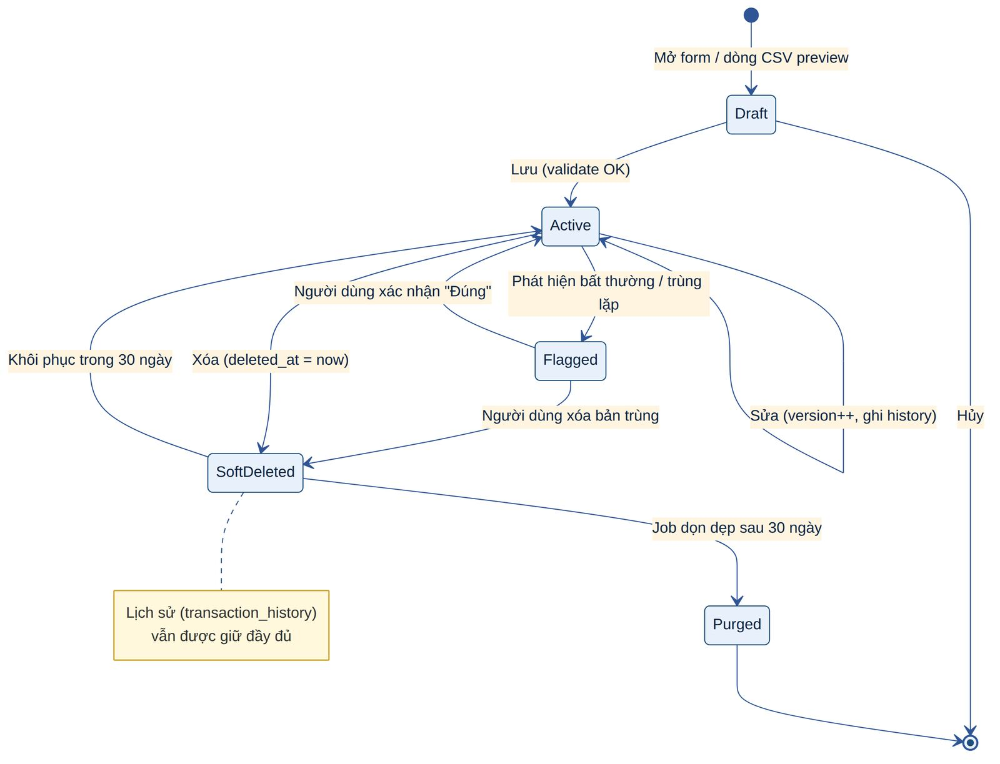
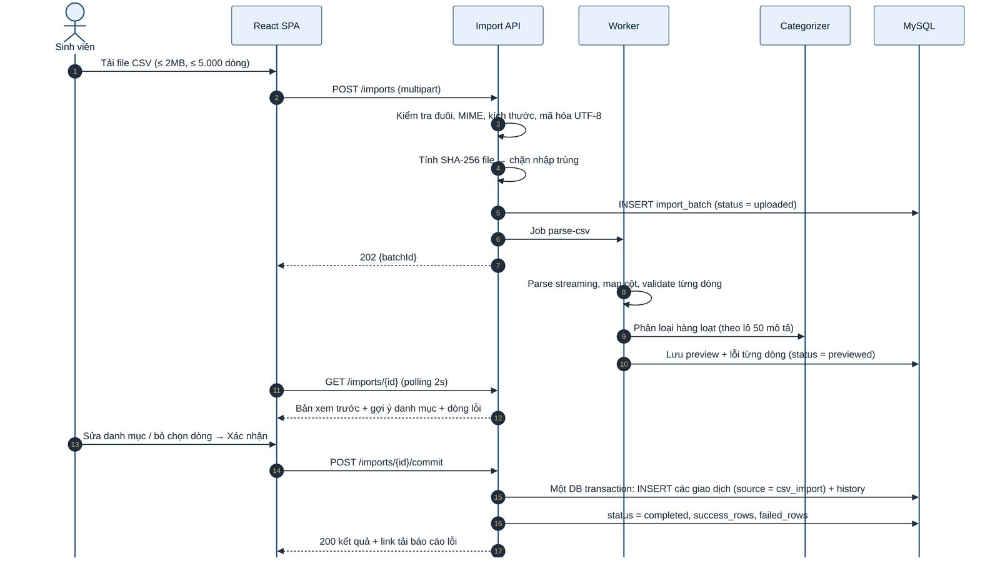

# 5. THIẾT KẾ CHỨC NĂNG CHI TIẾT

Chương này mô tả thiết kế chi tiết cho từng nhóm yêu cầu chức năng trong SRS mục 1.6. Mỗi chức năng gồm: mô tả, quy tắc nghiệp vụ (BR), luồng xử lý và các ràng buộc kiểm tra dữ liệu. Ma trận truy vết đầy đủ nằm ở Phụ lục A.

## 5.1 Xác thực và quản lý người dùng

### 5.1.1 Đăng ký và xác minh email

Sinh viên đăng ký bằng họ tên, email và mật khẩu. Tài khoản ở trạng thái pending cho tới khi xác minh email qua liên kết chứa token dùng một lần. Khi tạo tài khoản, hệ thống không sao chép danh mục mặc định mà tham chiếu tới danh mục hệ thống (user_id = NULL), nhờ đó admin cập nhật danh mục mặc định sẽ áp dụng cho mọi người dùng.

### 5.1.2 Đăng nhập và quản lý phiên

Sinh viên đăng nhập tại /login; quản trị viên đăng nhập tại cổng riêng /admin/login (SRS: "separate, direct-access administrator login") và bắt buộc qua bước MFA TOTP. Phiên làm việc dùng cặp access token (JWT, 15 phút, chỉ giữ trong bộ nhớ) và refresh token (chuỗi ngẫu nhiên 256-bit, lưu dạng băm SHA-256 trong DB, gửi qua cookie HttpOnly; Secure; SameSite=Strict; Path=/api/v1/auth). Refresh token được **xoay vòng** mỗi lần dùng; nếu một token cũ bị dùng lại, toàn bộ "họ" token bị thu hồi vì đó là dấu hiệu bị đánh cắp.

### 5.1.3 Quên và đặt lại mật khẩu

Người dùng nhập email tại trang Quên mật khẩu; hệ thống luôn trả cùng một thông điệp dù email có tồn tại hay không. Nếu tài khoản tồn tại, một token ngẫu nhiên 256-bit được sinh, chỉ lưu giá trị băm SHA-256, hết hạn sau 30 phút và vô hiệu hóa các token cũ. Sau khi đặt mật khẩu mới, mọi phiên đăng nhập bị thu hồi và người dùng nhận email thông báo.

***Bảng 14: Quy tắc nghiệp vụ – Xác thực***

| **Mã**   | **Quy tắc nghiệp vụ**                                                                                                                                            |
|----------|------------------------------------------------------------------------------------------------------------------------------------------------------------------|
| BR-AU-01 | Email là duy nhất, được chuẩn hóa chữ thường và cắt khoảng trắng; tối đa 254 ký tự.                                                                              |
| BR-AU-02 | Mật khẩu 10–128 ký tự, không bắt buộc ký tự đặc biệt nhưng bị từ chối nếu nằm trong danh sách mật khẩu phổ biến/bị lộ (NIST 800-63B); hiển thị thanh đo độ mạnh. |
| BR-AU-03 | Thông báo lỗi đăng nhập/đăng ký/quên mật khẩu là thông điệp chung, không tiết lộ email có tồn tại hay không.                                                     |
| BR-AU-04 | Sai mật khẩu 5 lần liên tiếp → khóa đăng nhập 15 phút (tăng dần: 15 → 30 → 60 phút) và gửi email cảnh báo.                                                       |
| BR-AU-05 | Token xác minh email hết hạn sau 24 giờ; token đặt lại mật khẩu hết hạn sau 30 phút; cả hai dùng một lần.                                                        |
| BR-AU-06 | Đặt lại/đổi mật khẩu thành công → thu hồi toàn bộ refresh token (đăng xuất mọi thiết bị) và gửi email thông báo.                                                 |
| BR-AU-07 | Tùy chọn "Ghi nhớ đăng nhập": refresh token 30 ngày; mặc định 7 ngày. Phiên admin: refresh 8 giờ, tự đăng xuất khi không hoạt động 30 phút.                      |
| BR-AU-08 | Tài khoản disabled không đăng nhập được; mọi refresh token bị thu hồi ngay khi admin vô hiệu hóa.                                                                |
| BR-AU-09 | Người dùng xem được danh sách phiên đăng nhập (thiết bị, thời gian) và đăng xuất từng phiên hoặc tất cả.                                                         |

### 5.1.4 Sơ đồ tuần tự các luồng xác thực

Ba sơ đồ dưới đây mô tả chi tiết thứ tự tương tác giữa trình duyệt, API, cơ sở dữ liệu và dịch vụ email cho các luồng đăng ký, đăng nhập/làm mới phiên và đặt lại mật khẩu.

***Hình 9: Sơ đồ tuần tự – Đăng ký và xác minh email***

***Hình 10: Sơ đồ tuần tự – Đăng nhập, gọi API và làm mới token***

***Hình 11: Sơ đồ tuần tự – Quên mật khẩu và đặt lại qua liên kết token***

## 5.2 Hồ sơ người dùng

Hồ sơ gồm các trường có thể chỉnh sửa theo SRS: họ tên, năm học, mức trợ cấp cơ sở hằng tháng (monthly_allowance_baseline), mục tiêu tiết kiệm hằng tháng; bổ sung: đơn vị tiền tệ, múi giờ, ngôn ngữ, tùy chọn giao diện (dark mode, cỡ chữ) và đồng ý sử dụng AI (ai_opt_in).

***Bảng 15: Trường dữ liệu hồ sơ***

| **Trường**         | **Kiểu / Ràng buộc**                           | **Ghi chú**                                                                 |
|--------------------|------------------------------------------------|-----------------------------------------------------------------------------|
| Họ tên             | Chuỗi 2–100 ký tự, loại bỏ thẻ HTML            | Dùng cho lời chào cá nhân hóa trên dashboard                                |
| Năm học            | Danh sách chọn: Năm 1…Năm 5, Sau đại học, Khác | Tùy chọn                                                                    |
| Trợ cấp cơ sở      | Số thập phân ≥ 0, tối đa 12 chữ số             | Dùng làm ngưỡng tham chiếu cho tips và phát hiện bất thường                 |
| Mục tiêu tiết kiệm | Số thập phân ≥ 0                               | Hiển thị tiến độ trên dashboard                                             |
| Tiền tệ            | ISO 4217 (USD, VND…)                           | Định dạng số theo locale; đổi tiền tệ không quy đổi dữ liệu cũ              |
| Đồng ý AI          | Boolean, mặc định false                        | Khi false: chỉ dùng tầng luật/từ khóa và template, không gửi dữ liệu ra LLM |

Ngoài ra người dùng có thể: đổi mật khẩu (yêu cầu mật khẩu hiện tại), **tải xuống toàn bộ dữ liệu cá nhân** (JSON/CSV) và **yêu cầu xóa tài khoản** (thời gian ân hạn 30 ngày trước khi xóa vĩnh viễn) – xem mục 9.14.

## 5.3 Quản lý danh mục

Danh mục gồm hai loại: **danh mục mặc định** do admin quản lý (áp dụng cho mọi người dùng) và **danh mục cá nhân** do sinh viên tạo trong mục "Manage Own Categories". Mỗi danh mục thuộc loại income hoặc expense.

***Bảng 16: Danh mục mặc định theo SRS***

| **Loại**           | **Danh mục mặc định (seed)**                                                                                                                                |
|--------------------|-------------------------------------------------------------------------------------------------------------------------------------------------------------|
| Thu nhập (income)  | Allowance · Part-time Job · Scholarship · Gift · Other Income                                                                                               |
| Chi tiêu (expense) | Food · Transport · Hostel/Rent · Academics (books, tuition, stationery) · Subscriptions (streaming, apps) · Entertainment (movies, outings) · Miscellaneous |

***Bảng 17: Quy tắc nghiệp vụ – Danh mục***

| **Mã**   | **Quy tắc nghiệp vụ**                                                                                                                                                      |
|----------|----------------------------------------------------------------------------------------------------------------------------------------------------------------------------|
| BR-CA-01 | Tên danh mục 1–50 ký tự, duy nhất trong phạm vi (người dùng, loại) và không trùng tên danh mục mặc định cùng loại.                                                         |
| BR-CA-02 | Sinh viên chỉ thêm/sửa/xóa danh mục cá nhân của mình; danh mục mặc định chỉ đọc (có thể ẩn khỏi danh sách chọn).                                                           |
| BR-CA-03 | Xóa danh mục đang có giao dịch: bắt buộc chọn danh mục thay thế để chuyển giao dịch sang (thực hiện trong một DB transaction), hoặc lưu trữ (archive – is_active = false). |
| BR-CA-04 | Mỗi người dùng tối đa 50 danh mục cá nhân (chống lạm dụng).                                                                                                                |
| BR-CA-05 | Admin vô hiệu hóa danh mục mặc định không làm mất giao dịch cũ; danh mục chỉ bị ẩn khỏi lựa chọn mới.                                                                      |

## 5.4 Ghi nhận thu nhập và chi tiêu

### 5.4.1 Thêm nhanh giao dịch

Nút "+ Thêm nhanh" luôn hiện trên dashboard, thanh điều hướng và nút nổi (FAB) trên mobile. Form gồm: loại (Thu/Chi – mặc định Chi), số tiền, ngày (mặc định hôm nay), mô tả, danh mục (AI gợi ý) và tùy chọn "Lặp lại". Phím tắt: N mở form, Enter lưu, Esc đóng.

***Hình 12: Lưu đồ – Thêm giao dịch với gợi ý danh mục AI***

***Bảng 18: Quy tắc nghiệp vụ – Giao dịch***

| **Mã**   | **Quy tắc nghiệp vụ**                                                                                                                                          |
|----------|----------------------------------------------------------------------------------------------------------------------------------------------------------------|
| BR-TX-01 | Số tiền \> 0 và ≤ 999.999.999.999,99; tối đa 2 chữ số thập phân (VND: 0 chữ số). Loại giao dịch quyết định dấu khi tính toán, không lưu số âm.                 |
| BR-TX-02 | Ngày giao dịch không vượt quá hôm nay + 1 ngày (cho phép lệch múi giờ) và không trước 01/01/2000.                                                              |
| BR-TX-03 | Danh mục phải cùng loại với giao dịch và thuộc về người dùng hoặc là danh mục mặc định đang hoạt động (kiểm tra ở server – chống gán danh mục của người khác). |
| BR-TX-04 | Mô tả tối đa 255 ký tự, được lưu dạng văn bản thuần; khi hiển thị luôn được escape (chống XSS).                                                                |
| BR-TX-05 | Sửa giao dịch dùng khóa lạc quan: client gửi version, server từ chối (409 Conflict) nếu phiên bản đã thay đổi.                                                 |
| BR-TX-06 | Sửa và xóa **giữ lại toàn bộ lịch sử** (SRS): mỗi thay đổi ghi một bản ghi transaction_history (append-only) chứa snapshot trước/sau.                          |
| BR-TX-07 | Xóa là xóa mềm; người dùng khôi phục được trong 30 ngày tại "Thùng rác"; sau 30 ngày job dọn dẹp xóa vĩnh viễn dữ liệu giao dịch (lịch sử được ẩn danh hóa).   |
| BR-TX-08 | Danh sách giao dịch phân trang (mặc định 20, tối đa 100), lọc theo khoảng ngày, loại, danh mục, khoảng số tiền, từ khóa mô tả; sắp xếp theo ngày/số tiền.      |

### 5.4.2 Giao dịch định kỳ

Người dùng có thể đánh dấu một giao dịch là định kỳ (ví dụ: trợ cấp hằng tháng, phí Netflix). Hệ thống lưu một **quy tắc định kỳ** (recurring_rules) và job hằng ngày sẽ sinh giao dịch thực tế khi tới hạn. Tần suất hỗ trợ: hằng tuần, hằng tháng (chọn ngày trong tháng), hằng năm, với hệ số lặp (mỗi N kỳ).

***Hình 13: Lưu đồ – Sinh giao dịch định kỳ***

- Ngày 29–31 ở tháng không có ngày đó sẽ lấy ngày cuối tháng.

- Ràng buộc duy nhất (recurring_rule_id, recurring_period) bảo đảm không bao giờ sinh trùng kể cả khi job chạy lại.

- Người dùng có thể tạm dừng, sửa (áp dụng cho các kỳ tương lai) hoặc xóa quy tắc; giao dịch đã sinh không bị ảnh hưởng.

- Nếu hệ thống ngừng vài ngày, job bù (catch-up) sinh đủ các kỳ bị lỡ, tối đa 12 kỳ mỗi quy tắc.

### 5.4.3 Vòng đời giao dịch

***Hình 14: Sơ đồ trạng thái – Vòng đời giao dịch***

## 5.5 Nhập giao dịch từ file CSV

SRS yêu cầu nhập hàng loạt giao dịch lịch sử từ CSV kèm gợi ý phân loại hàng loạt. Quy trình gồm ba bước: **Tải lên → Xem trước & chỉnh sửa → Xác nhận**. Không có dữ liệu nào được ghi vào bảng giao dịch trước khi người dùng xác nhận.

***Bảng 19: Định dạng file CSV nhập***

| **Cột CSV** | **Bắt buộc** | **Định dạng chấp nhận**                                            | **Ví dụ**         |
|-------------|--------------|--------------------------------------------------------------------|-------------------|
| date        | Có           | YYYY-MM-DD, DD/MM/YYYY, MM/DD/YYYY (người dùng chọn khi xem trước) | 2026-09-15        |
| amount      | Có           | Số dương, dấu thập phân "." hoặc ","; bỏ ký hiệu tiền tệ           | 4.50              |
| type        | Không        | income / expense (mặc định expense); hoặc suy ra từ dấu âm         | expense           |
| description | Có           | Văn bản ≤ 255 ký tự                                                | Campus Cafe latte |
| category    | Không        | Tên danh mục; để trống thì AI gợi ý                                | Food              |

- Giới hạn: file ≤ 2 MB, ≤ 5.000 dòng, mã hóa UTF-8 (tự nhận diện và loại BOM), phân tách bằng dấu phẩy hoặc chấm phẩy.

- Hệ thống cung cấp file mẫu tải về và giao diện ánh xạ cột nếu tên cột khác chuẩn.

- Phát hiện dòng trùng với giao dịch đã có (cùng ngày, số tiền, mô tả) và mặc định bỏ chọn các dòng đó.

- Bản xem trước lưu tạm 24 giờ; kết quả nhập gồm số dòng thành công, số dòng lỗi và file báo cáo lỗi có thể tải về.

- Chi tiết kiểm soát an toàn file xem mục 9.10.

***Hình 15: Sơ đồ tuần tự – Nhập CSV với phân loại hàng loạt***
