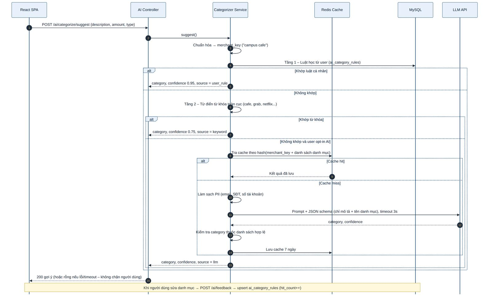
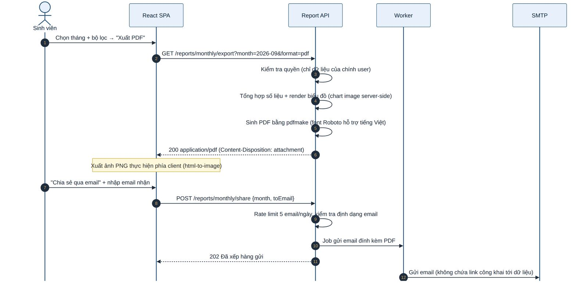
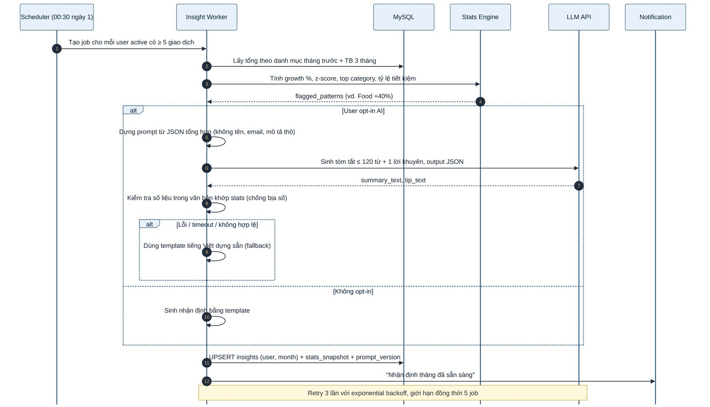
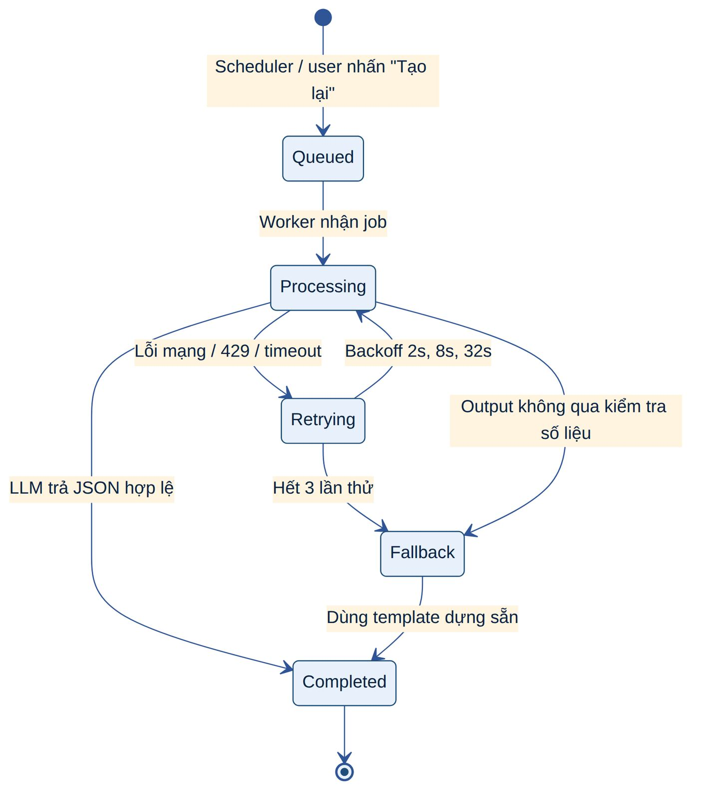
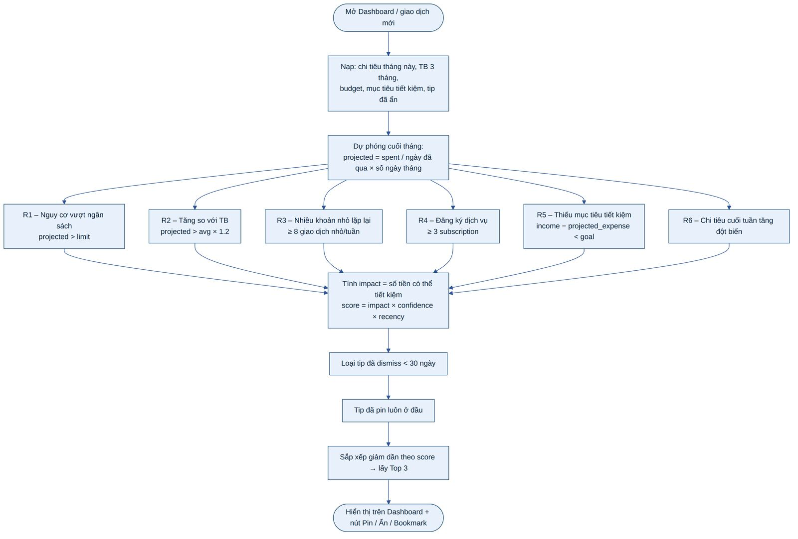

# 5. THIẾT KẾ CHỨC NĂNG CHI TIẾT

Chương này mô tả thiết kế chi tiết cho từng nhóm yêu cầu chức năng trong SRS mục 1.6. Mỗi chức năng gồm: mô tả, quy tắc nghiệp vụ (BR), luồng xử lý và các ràng buộc kiểm tra dữ liệu. Ma trận truy vết đầy đủ nằm ở Phụ lục A.

## 5.6 Trợ lý phân loại chi tiêu bằng AI

Khi người dùng gõ mô tả (ví dụ "Campus Cafe"), hệ thống gợi ý danh mục (Food). Bộ phân loại hoạt động theo **ba tầng**, dừng ở tầng đầu tiên cho kết quả đủ tin cậy:

***Bảng 20: Ba tầng phân loại***

| **Tầng**             | **Cơ chế**                                                                                                                                                         | **Độ tin cậy**                        | **Độ trễ**                |
|----------------------|--------------------------------------------------------------------------------------------------------------------------------------------------------------------|---------------------------------------|---------------------------|
| 1 – Luật cá nhân     | Tra ai_category_rules theo (user_id, merchant_key); luật được tạo/củng cố mỗi khi người dùng chọn hoặc sửa danh mục                                                | 0,95 (≥ 2 lần xác nhận) / 0,8 (1 lần) | \< 10 ms                  |
| 2 – Từ khóa toàn cục | Từ điển ~300 từ khóa song ngữ (cafe, cơm, grab, bus, netflix, spotify, sách, học phí, ktx…) ánh xạ tới danh mục mặc định                                           | 0,75                                  | \< 5 ms                   |
| 3 – LLM              | Prompt có ranh giới rõ ràng, chỉ gửi mô tả đã làm sạch + danh sách tên danh mục; yêu cầu đầu ra JSON {category, confidence}; kết quả không thuộc danh sách bị loại | Do mô hình trả về, giới hạn ≤ 0,9     | 300–1.500 ms, timeout 3 s |

- **Chuẩn hóa merchant key:** chữ thường, bỏ dấu tiếng Việt, bỏ số/ký tự đặc biệt, bỏ từ dừng ("tại", "at", "the"), cắt 100 ký tự. Ví dụ "Campus Café \#12" → "campus cafe".

- **Học từ sửa đổi:** khi người dùng đổi danh mục so với gợi ý (ai_overridden) hoặc chọn thủ công, hệ thống upsert luật (merchant_key → category) và tăng hit_count; luật mới thay thế luật cũ nếu bị sửa 2 lần liên tiếp.

- **Ghi đè thủ công:** gợi ý chỉ là giá trị mặc định có nhãn "Gợi ý AI"; người dùng luôn chọn lại được. Hệ thống lưu ai_suggested_category_id và ai_confidence để đo độ chính xác (tỷ lệ chấp nhận).

- **Phía client:** debounce 400 ms, hủy request cũ khi người dùng gõ tiếp; lỗi AI không bao giờ chặn việc lưu giao dịch.

- **Chi phí:** cache kết quả LLM theo hash(merchant_key + danh sách danh mục) 7 ngày; giới hạn 200 lời gọi LLM/người dùng/ngày.

***Hình 16: Sơ đồ tuần tự – Phân loại danh mục ba tầng***

## 5.7 Dashboard cá nhân hóa

Dashboard là trang đích sau khi đăng nhập, gồm các widget sau (dữ liệu lấy từ một endpoint tổng hợp /dashboard/summary được cache 60 giây và tự làm mới khi có giao dịch mới):

***Bảng 21: Các widget trên Dashboard***

| **Widget**             | **Nội dung**                                                                      | **Nguồn dữ liệu / Công thức**               |
|------------------------|-----------------------------------------------------------------------------------|---------------------------------------------|
| Lời chào               | "Chào buổi sáng, Phúc!" theo giờ địa phương + thông báo hệ thống đang hiệu lực    | Hồ sơ người dùng, announcements             |
| Số dư tháng này        | Tổng thu, tổng chi, chênh lệch; so sánh với tháng trước (%)                       | SUM theo type trong tháng hiện tại          |
| Nút thêm nhanh         | Thêm Thu / Thêm Chi / Nhập CSV                                                    | –                                           |
| Top danh mục tháng này | Danh mục chi nhiều nhất và tỷ trọng                                               | GROUP BY category ORDER BY SUM DESC LIMIT 1 |
| Ngân sách vs Thực tế   | Thanh tiến độ cho từng danh mục có ngân sách; xanh \< 80%, vàng 80–99%, đỏ ≥ 100% | budgets JOIN tổng chi theo danh mục         |
| Cơ cấu chi tiêu        | Biểu đồ doughnut theo danh mục                                                    | Tổng chi theo danh mục                      |
| Xu hướng 6 tháng       | Biểu đồ cột thu vs chi                                                            | Tổng theo tháng, 6 tháng gần nhất           |
| Mẹo tiết kiệm          | Top 3 tip theo điểm tác động, nút Pin / Ẩn / Lưu                                  | Tips engine (mục 5.10)                      |
| Mục tiêu tiết kiệm     | Tiến độ: (thu − chi) / mục tiêu                                                   | Hồ sơ + tổng tháng                          |
| Nhận định mới nhất     | Tóm tắt nhận định tháng trước + link xem chi tiết                                 | Bảng insights                               |
| Gần đây                | Giao dịch vừa xem/sửa gần nhất                                                    | recent_activity (mục 5.14)                  |

## 5.8 Báo cáo hằng tháng và xuất file

***Bảng 22: Các loại báo cáo***

| **Báo cáo**                | **Mô tả**                                                                                         | **Biểu đồ**                  |
|----------------------------|---------------------------------------------------------------------------------------------------|------------------------------|
| Theo danh mục              | Tổng chi/thu theo danh mục trong khoảng thời gian, tỷ trọng %, số giao dịch, so sánh với kỳ trước | Doughnut + bảng              |
| Thu vs Chi 6 tháng         | Tổng thu, tổng chi, tiết kiệm ròng từng tháng trong 6 tháng gần nhất                              | Cột nhóm + đường tiết kiệm   |
| Ngày / Tuần tháng hiện tại | Chi tiêu theo từng ngày và từng tuần (ISO week) của tháng hiện tại, đường trung bình              | Cột theo ngày, cột theo tuần |
| Dự báo tháng tới           | Dự báo thu/chi theo danh mục (mục 5.14)                                                           | Đường + vùng sai số          |

- **Bộ lọc chung:** khoảng ngày (preset: tháng này, tháng trước, 3/6 tháng, tùy chọn), danh mục (nhiều lựa chọn), nguồn thu nhập. Bộ lọc được phản ánh lên URL query để chia sẻ/bookmark trạng thái.

- **Xuất PDF** (server-side, pdfmake, font Roboto hỗ trợ tiếng Việt): trang bìa tháng, bảng tổng hợp, biểu đồ, top giao dịch, nhận định tháng (nếu có), ghi chú miễn trừ "không phải tư vấn tài chính".

- **Xuất ảnh PNG** (client-side): chụp vùng báo cáo đang hiển thị.

- **Chia sẻ qua email:** gửi PDF đính kèm tới email do người dùng nhập; giới hạn 5 email/ngày; không đính kèm liên kết công khai tới dữ liệu.

- Hiệu năng: truy vấn tổng hợp dùng chỉ mục (user_id, txn_date) và (user_id, category_id, txn_date); các tháng đã kết thúc được cache lâu hơn (1 giờ).

***Hình 17: Sơ đồ tuần tự – Xuất và chia sẻ báo cáo***

## 5.9 Nhận định chi tiêu hằng tháng bằng AI

Vào 00:30 ngày 1 hằng tháng (và khi người dùng nhấn "Tạo lại", tối đa 3 lần/tháng), hệ thống sinh nhận định cho tháng trước với người dùng có ≥ 5 giao dịch. Nguyên tắc cốt lõi: **backend tính toàn bộ số liệu, LLM chỉ diễn đạt**.

### 5.9.1 Thuật toán phát hiện mẫu chi tiêu

1.  Với mỗi danh mục chi c: tính cur(c) = tổng chi tháng M; avg3(c) = trung bình 3 tháng trước đó (bỏ qua tháng không có dữ liệu, cần ≥ 2 tháng).

2.  Tăng trưởng g(c) = (cur − avg3) / avg3. Đánh dấu (flag) nếu g ≥ 25% **và** chênh lệch tuyệt đối ≥ max(5 đơn vị tiền, 5% trợ cấp cơ sở).

3.  Bổ sung cờ: vượt ngân sách, tỷ lệ tiết kiệm tháng (thu − chi)/thu, danh mục mới xuất hiện, giao dịch bất thường lớn nhất.

4.  Chọn tối đa 3 mẫu có chênh lệch tuyệt đối lớn nhất để đưa vào nhận định.

5.  Sinh lời khuyên hành động cụ thể: hạn mức tuần đề xuất = avg3 / 4,33 (làm tròn); hoặc gợi ý thay thế chi phí thấp theo danh mục (nấu ăn tại KTX, vé tháng xe buýt, gói sinh viên…).

### 5.9.2 Thiết kế prompt và kiểm soát đầu ra

- **Đầu vào LLM** chỉ là JSON tổng hợp: tháng, đơn vị tiền, tổng thu/chi, danh sách mẫu đã flag (tên danh mục, cur, avg3, g), tỷ lệ tiết kiệm, ngôn ngữ. **Không** gửi họ tên, email, mô tả giao dịch thô.

- **Ràng buộc prompt:** vai trò "trợ lý tài chính thân thiện cho sinh viên"; ≤ 120 từ; chỉ dùng số có trong dữ liệu; không khuyên đầu tư/vay nợ; giọng tích cực; đầu ra JSON {summary_text, tip_text}; temperature 0,3.

- **Kiểm tra đầu ra:** parse JSON theo schema; độ dài hợp lệ; mọi con số xuất hiện trong văn bản phải khớp (sai số làm tròn) với số liệu đầu vào; lọc nội dung không phù hợp. Không đạt → dùng template.

- Lưu stats_snapshot, model, prompt_version để truy vết và tái lập kết quả; hiển thị nhãn "Nhận định do AI tạo – chỉ mang tính tham khảo".

- Lịch sử nhận định được lưu theo tháng, người dùng xem lại và bookmark được.

***Hình 18: Sơ đồ tuần tự – Sinh nhận định hằng tháng***

***Hình 19: Sơ đồ trạng thái – Job sinh nhận định***

## 5.10 Engine mẹo tiết kiệm cá nhân hóa

Engine mẹo **không phụ thuộc AI**: sinh tip từ dữ liệu trong CSDL bằng cách so sánh chi tiêu hiện tại với trung bình lịch sử và ngân sách/mục tiêu (đúng yêu cầu SRS). Mỗi tip được xếp hạng theo **tác động tiết kiệm tiềm năng**.

***Bảng 23: Bộ quy tắc sinh mẹo***

| **Quy tắc**                    | **Điều kiện kích hoạt**                                | **Tác động (impact) ước tính** | **Ví dụ nội dung**                                                              |
|--------------------------------|--------------------------------------------------------|--------------------------------|---------------------------------------------------------------------------------|
| R1 Nguy cơ vượt ngân sách      | projected(c) \> limit(c)                               | projected − limit              | "Với tốc độ hiện tại, Food sẽ vượt ngân sách 12 USD. Thử giới hạn 20 USD/tuần." |
| R2 Tăng so với trung bình      | projected(c) \> 1,2 × avg3(c)                          | projected − avg3               | "Chi Entertainment tăng 35% so với thường lệ."                                  |
| R3 Khoản nhỏ lặp lại           | ≥ 8 giao dịch \< 5% trợ cấp trong 7 ngày cùng danh mục | 50% tổng các khoản nhỏ         | "11 lần mua đồ uống tuần này = 27 USD. Pha cà phê tại phòng tiết kiệm ~13 USD." |
| R4 Nhiều dịch vụ đăng ký       | ≥ 3 giao dịch định kỳ thuộc Subscriptions              | Khoản đăng ký nhỏ nhất         | "Bạn đang trả 4 gói đăng ký. Kiểm tra gói ít dùng nhất?"                        |
| R5 Chưa đạt mục tiêu tiết kiệm | thu − projected_chi \< mục tiêu                        | Khoảng thiếu hụt               | "Còn thiếu 15 USD để đạt mục tiêu tháng."                                       |
| R6 Chi cuối tuần tăng vọt      | Chi T7–CN \> 1,5 × trung bình ngày thường × 2          | Phần vượt                      | "Cuối tuần chiếm 45% chi tiêu tuần này."                                        |
| R0 Mẫu chung (admin)           | Luôn khả dụng, điểm thấp                               | Cố định nhỏ                    | Mẹo chung do admin soạn trong Tip Templates                                     |

- projected(c) = spent_to_date(c) / số_ngày_đã_qua × số_ngày_trong_tháng (chỉ áp dụng từ ngày thứ 5 của tháng để tránh nhiễu).

- score = impact × confidence × recency; confidence phụ thuộc số tháng lịch sử (1 tháng: 0,5; 2: 0,75; ≥3: 1,0); recency giảm dần nếu tip đã hiển thị nhiều ngày không tương tác.

- Tip đã **pin** luôn hiển thị đầu; tip **dismiss** không xuất hiện lại trong 30 ngày (cùng quy tắc + danh mục). Hiển thị Top 3 trên dashboard, xem tất cả ở trang Mẹo.

- Nội dung tip được render từ tip_templates (admin quản lý) với biến {category}, {amount}, {percent}; mọi biến được escape.

***Hình 20: Lưu đồ – Engine sinh và xếp hạng mẹo tiết kiệm***
