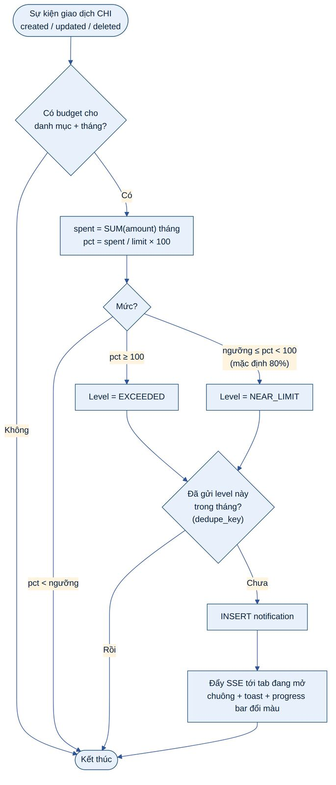
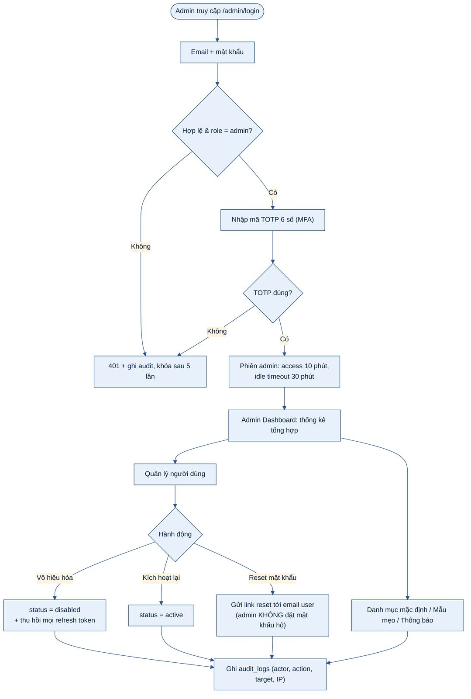

# 5. THIẾT KẾ CHỨC NĂNG CHI TIẾT

Chương này mô tả thiết kế chi tiết cho từng nhóm yêu cầu chức năng trong SRS mục 1.6. Mỗi chức năng gồm: mô tả, quy tắc nghiệp vụ (BR), luồng xử lý và các ràng buộc kiểm tra dữ liệu. Ma trận truy vết đầy đủ nằm ở Phụ lục A.

## 5.11 Ngân sách và cảnh báo

Sinh viên đặt hạn mức theo danh mục chi cho từng tháng (ví dụ Food: 30 USD). Có chức năng "Sao chép ngân sách tháng trước". Mức tiêu thụ hiển thị theo thời gian thực bằng progress bar; khi giao dịch mới làm tiêu thụ chạm ngưỡng cảnh báo (mặc định 80%, tùy chỉnh 50–100%) hoặc vượt 100%, hệ thống gửi thông báo trong ứng dụng.

***Hình 21: Lưu đồ – Kiểm tra ngân sách và gửi cảnh báo***

- Mỗi mức cảnh báo (NEAR_LIMIT, EXCEEDED) chỉ gửi **một lần** cho mỗi ngân sách mỗi tháng nhờ khóa dedupe_key duy nhất; nếu người dùng xóa giao dịch khiến mức tiêu thụ giảm xuống dưới ngưỡng rồi lại vượt, cảnh báo được phép gửi lại.

- Thông báo được đẩy qua SSE (kênh Redis pub/sub để hoạt động với nhiều instance API) và hiển thị ở chuông thông báo + toast; client không mở SSE thì dữ liệu được lấy khi polling 60 giây.

- Kết nối SSE xác thực bằng **vé dùng một lần** (ticket 30 giây) lấy qua API có access token, vì EventSource không gửi được header Authorization.

## 5.12 Bookmark, ghi chú và chia sẻ

- Người dùng bookmark một mẹo, một nhận định tháng hoặc một báo cáo (lưu bộ lọc) để xem lại; mỗi bookmark có ghi chú cá nhân ≤ 500 ký tự.

- Trang "Đã lưu" liệt kê theo loại, tìm kiếm theo ghi chú; xóa bookmark không ảnh hưởng đối tượng gốc.

- Xuất báo cáo tháng hoặc bản tóm tắt tiết kiệm dạng PDF và chia sẻ qua email (mục 5.8).

## 5.13 Bảng điều khiển quản trị

***Hình 22: Lưu đồ – Đăng nhập quản trị và quản lý người dùng***

***Bảng 24: Chức năng quản trị***

| **Chức năng**        | **Chi tiết**                                                                                                                                             | **Ràng buộc bảo mật**                                                                                                              |
|----------------------|----------------------------------------------------------------------------------------------------------------------------------------------------------|------------------------------------------------------------------------------------------------------------------------------------|
| Danh mục mặc định    | Thêm/sửa/ẩn danh mục income/expense áp dụng cho mọi sinh viên; sắp xếp thứ tự, biểu tượng, màu                                                           | Không xóa cứng danh mục đã có giao dịch                                                                                            |
| Mẫu mẹo & thông báo  | CRUD tip templates (quy tắc, tiêu đề, nội dung có biến); CRUD thông báo hệ thống có thời gian hiệu lực                                                   | Nội dung được lọc HTML, xem trước trước khi xuất bản                                                                               |
| Tài khoản người dùng | Tìm kiếm, xem thông tin tài khoản (tên, email, trạng thái, ngày tạo, lần đăng nhập cuối, số giao dịch), vô hiệu hóa/kích hoạt, gửi link đặt lại mật khẩu | Admin không xem chi tiết giao dịch cá nhân; không tự đặt mật khẩu cho người dùng; email hiển thị dạng che một phần trong danh sách |
| Thống kê sử dụng     | Người dùng hoạt động (DAU/MAU), tổng giao dịch, danh mục được dùng nhiều nhất, tỷ lệ chấp nhận gợi ý AI, số nhận định đã sinh                            | Chỉ số tổng hợp, ẩn nhóm \< 5 người dùng (k-anonymity)                                                                             |
| Nhật ký kiểm toán    | Tra cứu audit log theo thời gian, hành động, người thực hiện                                                                                             | Chỉ đọc; không sửa/xóa được                                                                                                        |

## 5.14 Trí tuệ hệ thống (Advanced UX)

***Bảng 25: Tính năng trí tuệ hệ thống***

| **Tính năng**                  | **Thiết kế**                                                                                                                                                                                                                                               |
|--------------------------------|------------------------------------------------------------------------------------------------------------------------------------------------------------------------------------------------------------------------------------------------------------|
| Giao dịch xem/sửa gần đây      | Ghi recent_activity khi mở chi tiết hoặc sửa giao dịch; giữ 20 bản ghi gần nhất mỗi người dùng; đồng bộ qua các phiên/thiết bị vì lưu phía server                                                                                                          |
| Dự báo tháng tới               | Cho mỗi danh mục: trung bình trượt có trọng số 3 tháng (0,5 · M−1 + 0,3 · M−2 + 0,2 · M−3), cộng các khoản định kỳ đã biết; khoảng tin cậy ±1 độ lệch chuẩn; cần ≥ 2 tháng dữ liệu, nếu không hiển thị "Chưa đủ dữ liệu"                                   |
| Phát hiện giao dịch bất thường | Với danh mục có ≥ 5 giao dịch trong 90 ngày: bất thường nếu số tiền \> trung bình + 3σ hoặc \> 3 × trung vị, **và** \> 20% trợ cấp cơ sở. Đánh dấu is_anomaly, thông báo "Khoản chi lớn bất thường – có đúng không?"                                       |
| Phát hiện trùng lặp            | Cùng người dùng, cùng số tiền và loại, cùng danh mục hoặc merchant_key giống nhau (khoảng cách Levenshtein ≤ 2), ngày chênh ≤ 1, tạo cách nhau ≤ 10 phút, không phải giao dịch định kỳ → is_possible_duplicate; người dùng chọn "Giữ" hoặc "Xóa bản trùng" |

## 5.15 Khả năng tiếp cận và nâng cao giao diện

- **Dark mode:** công tắc trên thanh điều hướng, dùng color mode của Bootstrap 5.3 (data-bs-theme), mặc định theo hệ điều hành (prefers-color-scheme), lưu lựa chọn; bảng màu biểu đồ có biến thể tối bảo đảm độ tương phản.

- **Điều chỉnh cỡ chữ:** 4 mức (90%, 100%, 115%, 130%) thay đổi font-size gốc; toàn bộ kích thước dùng rem nên co giãn đồng bộ.

- **Breadcrumbs:** hiển thị ở mọi trang con (ví dụ Trang chủ › Báo cáo › Theo danh mục), sinh tự động từ cấu hình route.

- **Chuyển cảnh và chỉ báo tải:** skeleton cho thẻ/biểu đồ, spinner cho nút đang xử lý, hiệu ứng chuyển trang 150–200 ms; tôn trọng prefers-reduced-motion.

- Chi tiết tiêu chí WCAG xem mục 8.5.
