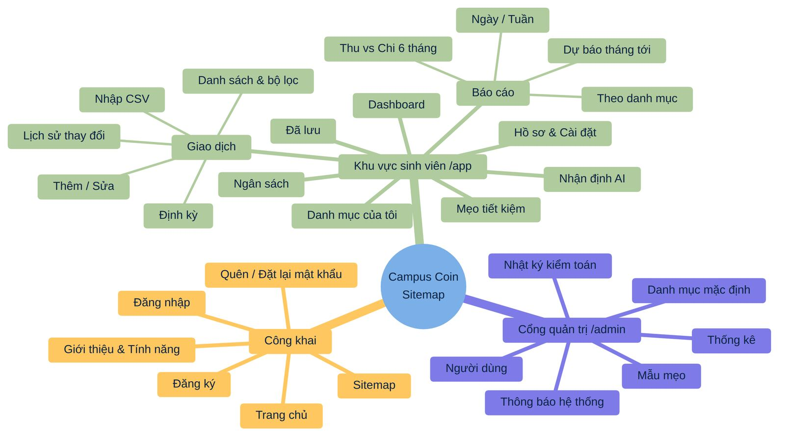

# 8. THIẾT KẾ GIAO DIỆN NGƯỜI DÙNG

## 8.1 Sitemap

SRS yêu cầu sitemap được thêm vào trang chủ. Sitemap hiển thị dạng trang /sitemap (liên kết ở footer mọi trang) và file sitemap.xml cho các trang công khai. Sơ đồ điều hướng tổng thể:

***Hình 25: Sitemap của Campus Coin***

## 8.2 Hệ thống thiết kế (Design System)

***Bảng 47: Design tokens***

| **Thành phần**      | **Giá trị (chế độ sáng)**                               | **Chế độ tối**         | **Sử dụng**                                            |
|---------------------|---------------------------------------------------------|------------------------|--------------------------------------------------------|
| Màu chính (Primary) | \#1F4E79 (xanh navy)                                    | \#6EA8FE               | Nút chính, liên kết, tiêu đề                           |
| Màu nhấn (Accent)   | \#F5B400 (vàng "BudgetBee")                             | \#FFD24D               | Điểm nhấn, biểu tượng, mục tiêu tiết kiệm              |
| Thu nhập            | \#1E8E3E (xanh lá)                                      | \#5DD27A               | Số tiền thu, trạng thái tốt                            |
| Chi tiêu            | \#C62828 (đỏ)                                           | \#FF7B72               | Số tiền chi, vượt ngân sách                            |
| Cảnh báo            | \#B26A00 (cam)                                          | \#FFB74D               | Ngân sách 80–99%                                       |
| Nền / Bề mặt        | \#F7F9FC / \#FFFFFF                                     | \#0F1720 / \#1A2330    | Nền trang / thẻ                                        |
| Chữ                 | \#1F2D3D; phụ \#5B6B7F                                  | \#E6EDF3; phụ \#9FB0C3 | Tỷ lệ tương phản ≥ 4.5:1                               |
| Phông chữ           | Inter (tự host), dự phòng system-ui                     | –                      | Hỗ trợ tiếng Việt đầy đủ; số dạng tabular cho cột tiền |
| Cỡ chữ              | Gốc 16px; H1 2rem, H2 1.5rem, body 1rem, small 0.875rem | –                      | Co giãn theo mức font-size người dùng chọn             |
| Khoảng cách         | Thang 4px (0.25rem): 4, 8, 12, 16, 24, 32, 48           | –                      | Utility spacing của Bootstrap                          |
| Bo góc / đổ bóng    | 12px cho thẻ, 8px cho nút; bóng nhẹ 1 cấp               | Viền 1px thay bóng     | Nhất quán thành phần                                   |
| Biểu tượng          | Bootstrap Icons (SVG)                                   | –                      | Có aria-label hoặc aria-hidden                         |

## 8.3 Các màn hình chính

***Bảng 48: Mô tả màn hình***

| **Màn hình**        | **Thành phần chính**                                                                           | **Hành vi đặc biệt**                                                     |
|---------------------|------------------------------------------------------------------------------------------------|--------------------------------------------------------------------------|
| Trang chủ (Landing) | Hero giới thiệu, 6 tính năng nổi bật, hướng dẫn 3 bước, CTA đăng ký, footer có sitemap         | Tối ưu SEO: meta, Open Graph, SSR không bắt buộc (trang tĩnh pre-render) |
| Đăng ký / Đăng nhập | Form tối giản, hiện/ẩn mật khẩu, đo độ mạnh, link quên mật khẩu                                | Thông báo lỗi chung; chặn gửi lặp khi đang xử lý                         |
| Onboarding          | 3 bước: trợ cấp cơ sở → mục tiêu tiết kiệm → đồng ý AI (có giải thích rõ dữ liệu nào được gửi) | Có thể bỏ qua, chỉnh lại trong hồ sơ                                     |
| Dashboard           | Lưới widget 12 cột (mục 5.7); FAB "+" trên mobile                                              | Skeleton khi tải; tự làm mới khi có giao dịch                            |
| Giao dịch           | Thanh lọc, bảng (desktop) / danh sách thẻ (mobile), phân trang, nhãn cờ bất thường/trùng       | Vuốt để sửa/xóa trên mobile; hoàn tác xóa trong 5 giây                   |
| Form giao dịch      | Thu/Chi toggle, số tiền (bàn phím số), ngày, mô tả, danh mục + chip "Gợi ý AI", lặp lại        | Tự focus trường số tiền; phím tắt                                        |
| Nhập CSV            | Wizard 3 bước: tải lên → ánh xạ & xem trước (bảng sửa được) → kết quả                          | Hiển thị dòng lỗi màu đỏ với lý do                                       |
| Ngân sách           | Chọn tháng, danh sách danh mục với ô hạn mức và progress bar                                   | Sao chép tháng trước; tổng ngân sách vs trợ cấp                          |
| Báo cáo             | Tab 4 loại báo cáo, bộ lọc, biểu đồ + bảng, nút Xuất PDF/PNG, Chia sẻ                          | Bảng dữ liệu thay thế cho biểu đồ (accessibility)                        |
| Nhận định           | Dòng thời gian theo tháng, thẻ nhận định với cờ danh mục, nút Bookmark, Tạo lại                | Nhãn "Do AI tạo – tham khảo"                                             |
| Hồ sơ & Cài đặt     | Tab: Hồ sơ, Bảo mật (đổi mật khẩu, phiên), Giao diện, Quyền riêng tư (AI, xuất/xóa dữ liệu)    | Xác nhận lại mật khẩu cho thao tác nhạy cảm                              |
| Admin               | Sidebar riêng, thẻ thống kê, bảng người dùng có tìm kiếm, CRUD dạng modal, audit log           | Banner môi trường; tự đăng xuất khi không hoạt động 30 phút              |

## 8.4 Thiết kế đáp ứng (Responsive)

***Bảng 49: Breakpoint responsive***

| **Breakpoint (Bootstrap)**  | **Thiết bị**             | **Bố cục**                                                                                  |
|-----------------------------|--------------------------|---------------------------------------------------------------------------------------------|
| \< 576px (xs)               | Điện thoại               | 1 cột; điều hướng dạng thanh dưới (bottom nav) 5 mục; FAB thêm nhanh; bảng chuyển thành thẻ |
| ≥ 576px (sm) / ≥ 768px (md) | Điện thoại ngang, tablet | 2 cột widget; sidebar thu gọn thành biểu tượng                                              |
| ≥ 992px (lg)                | Laptop                   | Sidebar đầy đủ; dashboard 3 cột                                                             |
| ≥ 1200px (xl, xxl)          | Màn hình lớn             | Giới hạn chiều rộng nội dung 1320px; 4 cột widget                                           |

## 8.5 Khả năng tiếp cận (WCAG 2.2 AA)

- Tương phản văn bản ≥ 4.5:1 (chữ lớn ≥ 3:1) ở cả hai chế độ sáng/tối; không truyền đạt thông tin chỉ bằng màu (progress bar kèm %, số tiền kèm dấu +/−).

- Toàn bộ chức năng dùng được bằng bàn phím; thứ tự focus hợp lý; focus ring rõ ràng; liên kết "Bỏ qua tới nội dung chính".

- HTML ngữ nghĩa (header, nav, main, form, label); mọi input có label; lỗi form được liên kết bằng aria-describedby và thông báo qua aria-live.

- Biểu đồ có mô tả văn bản và bảng dữ liệu thay thế; modal bẫy focus và đóng bằng Esc.

- Vùng chạm tối thiểu 24×24px (khuyến nghị 44×44px trên mobile); hỗ trợ phóng to 200% không vỡ bố cục.

- Kiểm tra tự động bằng axe-core trong Playwright và Lighthouse (mục tiêu Accessibility ≥ 95).

## 8.6 Trạng thái giao diện

***Bảng 50: Trạng thái giao diện***

| **Trạng thái** | **Thiết kế**                                                                                    |
|----------------|-------------------------------------------------------------------------------------------------|
| Đang tải       | Skeleton cùng kích thước nội dung (tránh nhảy bố cục – CLS); spinner trong nút khi gửi form     |
| Rỗng           | Minh họa thân thiện + hướng dẫn hành động (ví dụ "Chưa có giao dịch – Thêm giao dịch đầu tiên") |
| Lỗi            | Thông báo dễ hiểu + nút "Thử lại"; lỗi mạng hiển thị banner ngoại tuyến                         |
| Thành công     | Toast 3 giây, có nút "Hoàn tác" với thao tác xóa                                                |
| AI đang xử lý  | Chip "Đang gợi ý…" trong ô danh mục; thẻ nhận định hiển thị "Đang tạo nhận định…"               |
