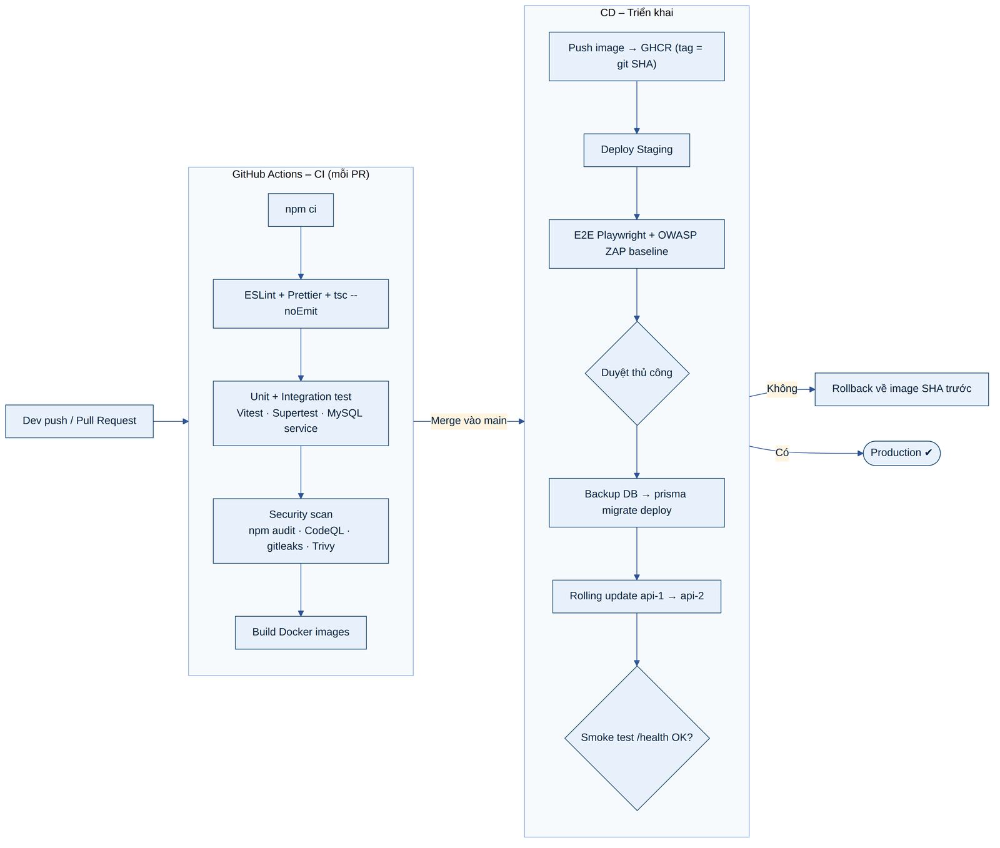

# 10. HIỆU NĂNG, KHẢ NĂNG MỞ RỘNG VÀ TÍNH SẴN SÀNG

## 10.1 Chỉ tiêu hiệu năng

***Bảng 60: Chỉ tiêu hiệu năng***

| **Chỉ số**                    | **Mục tiêu**                                     | **Cách đo**             |
|-------------------------------|--------------------------------------------------|-------------------------|
| API đọc (danh sách, chi tiết) | p95 \< 200 ms                                    | k6, log thời gian xử lý |
| API ghi (tạo/sửa giao dịch)   | p95 \< 300 ms                                    | k6                      |
| Dashboard summary             | p95 \< 400 ms (cache miss), \< 50 ms (cache hit) | k6, Redis metrics       |
| Gợi ý danh mục                | Tầng 1–2 \< 50 ms; tầng LLM p95 \< 1,5 s         | Log AI Adapter          |
| Largest Contentful Paint      | \< 2,5 s trên 4G                                 | Lighthouse, Web Vitals  |
| Interaction to Next Paint     | \< 200 ms                                        | Web Vitals              |
| Cumulative Layout Shift       | \< 0,1                                           | Web Vitals              |
| Bundle JS ban đầu             | \< 200 KB gzip                                   | Vite build report       |
| Thông lượng                   | ≥ 300 request/giây với 2 instance API            | k6 load test            |
| Sinh PDF báo cáo              | \< 3 s                                           | Log server              |

## 10.2 Chiến lược tối ưu

- **Frontend:** chia nhỏ bundle theo route, lazy-load Chart.js; tree-shaking Bootstrap (chỉ import SCSS module cần dùng); nén Brotli/gzip; tài nguyên có hash cache 1 năm; prefetch dữ liệu dashboard ngay sau đăng nhập; optimistic update khi thêm giao dịch.

- **Backend:** truy vấn tổng hợp bằng SQL (không kéo dữ liệu về rồi tính trong Node); chỉ SELECT cột cần; connection pool Prisma (10 kết nối/instance); gzip phản hồi; tác vụ nặng (PDF email, nhận định, import) đưa vào queue.

- **CSDL:** chỉ mục phủ cho các truy vấn chính (mục 6.4); tránh OFFSET lớn bằng keyset pagination cho danh sách dài; kiểm tra slow query log (\> 200 ms).

- **AI:** debounce phía client, cache kết quả, ưu tiên tầng luật cục bộ; gọi LLM theo lô khi nhập CSV.

## 10.3 Chiến lược cache

***Bảng 61: Chiến lược cache***

| **Dữ liệu**                        | **Nơi cache**                | **TTL**                  | **Vô hiệu hóa**                            |
|------------------------------------|------------------------------|--------------------------|--------------------------------------------|
| Dashboard summary (tháng hiện tại) | Redis: dash:{userId}:{month} | 60 s                     | Sự kiện giao dịch/ngân sách của người dùng |
| Báo cáo tháng đã kết thúc          | Redis                        | 1 giờ                    | Sự kiện giao dịch thuộc tháng đó           |
| Danh mục (mặc định + cá nhân)      | Redis + TanStack Query       | 10 phút                  | CRUD danh mục                              |
| Kết quả phân loại LLM              | Redis: ai:{hash}             | 7 ngày                   | Thay đổi danh sách danh mục                |
| Thông báo hệ thống đang hiệu lực   | Redis                        | 5 phút                   | CRUD announcement                          |
| Tài nguyên tĩnh SPA                | Cloudflare CDN + trình duyệt | 1 năm (tên file có hash) | Build mới                                  |
| Dữ liệu API phía client            | TanStack Query               | staleTime 30 s           | invalidateQueries sau mutation             |

## 10.4 Khả năng mở rộng

***Bảng 62: Lộ trình mở rộng***

| **Giai đoạn**          | **Quy mô**            | **Hành động**                                                                                                                                                                   |
|------------------------|-----------------------|---------------------------------------------------------------------------------------------------------------------------------------------------------------------------------|
| Giai đoạn 1 (hiện tại) | ≤ 10.000 người dùng   | 1 VPS, 2 instance API, 1 worker, MySQL + Redis cùng máy                                                                                                                         |
| Giai đoạn 2            | ≤ 100.000 người dùng  | Tách MySQL và Redis sang dịch vụ được quản lý; tăng số instance API (stateless) sau load balancer; thêm read replica cho báo cáo; bảng tổng hợp monthly_category_totals         |
| Giai đoạn 3            | \> 100.000 người dùng | Container orchestration (Kubernetes/ECS) với autoscaling; phân vùng bảng transactions theo năm; tách AI và báo cáo thành service riêng qua Redis Streams; CDN cho API công khai |

Các điểm thiết kế hỗ trợ mở rộng ngay từ đầu: API stateless (JWT), phiên lưu DB, SSE phân phối qua Redis pub/sub, job idempotent chạy an toàn trên nhiều worker, module có ranh giới rõ ràng.

## 10.5 Tính sẵn sàng và giám sát

- **Mục tiêu uptime:** ≥ 99,5%/tháng (SRS yêu cầu 24/7 với thời gian ngừng tối thiểu).

- **Health check:** /health/live (tiến trình sống) và /health/ready (kết nối DB, Redis OK); Docker restart policy unless-stopped; Nginx loại instance không khỏe.

- **Triển khai không gián đoạn:** rolling update từng instance API; migration tương thích ngược; graceful shutdown (ngừng nhận request, hoàn tất request đang xử lý trong 10 s, đóng kết nối).

- **Suy giảm mềm (graceful degradation):** LLM lỗi → tầng luật/template; Redis lỗi → bỏ qua cache, đọc DB trực tiếp; SMTP lỗi → job retry.

- **Giám sát:** UptimeRobot ping 1 phút; Sentry cho lỗi frontend/backend; metrics Prometheus (tùy chọn): request rate, error rate, latency p95, queue length, job failed; cảnh báo qua email/Telegram.

- **Bảo trì:** trang bảo trì tĩnh do Nginx phục vụ khi bật cờ; thông báo trước qua announcements.

# 11. TRIỂN KHAI VÀ VẬN HÀNH

## 11.1 Các môi trường

***Bảng 63: Các môi trường***

| **Môi trường** | **Mục đích**                              | **Dữ liệu**       | **Cấu hình đặc thù**                                                          |
|----------------|-------------------------------------------|-------------------|-------------------------------------------------------------------------------|
| Local (dev)    | Phát triển                                | Seed demo         | Docker Compose dev (MySQL, Redis, Mailpit bắt email), hot reload, Swagger bật |
| Staging        | Kiểm thử tích hợp, E2E, demo cho hội đồng | Seed demo 6 tháng | Giống production; ZAP scan; LLM dùng khóa riêng có quota thấp                 |
| Production     | Người dùng thật                           | Dữ liệu thật      | Swagger tắt, log mức info, backup, giám sát, MFA admin bắt buộc               |

## 11.2 Pipeline CI/CD

***Hình 28: Pipeline CI/CD với GitHub Actions***

## 11.3 Cấu hình môi trường

Ứng dụng đọc cấu hình từ biến môi trường, được validate khi khởi động. Bảng dưới liệt kê tên biến (không kèm giá trị bí mật):

***Bảng 64: Biến môi trường***

| **Nhóm**      | **Biến môi trường**                                                                           | **Mô tả**                                              |
|---------------|-----------------------------------------------------------------------------------------------|--------------------------------------------------------|
| Ứng dụng      | NODE_ENV, PORT, APP_URL, API_URL, CORS_ORIGINS, LOG_LEVEL                                     | Môi trường, cổng, URL, origin cho phép                 |
| Cơ sở dữ liệu | DATABASE_URL, DATABASE_MIGRATOR_URL                                                           | Chuỗi kết nối tài khoản ứng dụng / tài khoản migration |
| Redis         | REDIS_URL                                                                                     | Kết nối Redis có mật khẩu                              |
| Xác thực      | JWT_PRIVATE_KEY, JWT_PUBLIC_KEY, JWT_KID, ACCESS_TOKEN_TTL, REFRESH_TOKEN_TTL, IP_HASH_SECRET | Khóa ký và thời hạn token                              |
| Mã hóa        | DATA_ENCRYPTION_KEY, DATA_ENCRYPTION_KEY_VERSION                                              | Khóa AES-256-GCM cho trường nhạy cảm                   |
| Email         | SMTP_HOST, SMTP_PORT, SMTP_USER, SMTP_PASS, MAIL_FROM                                         | Gửi email                                              |
| AI            | AI_PROVIDER, AI_API_KEY, AI_MODEL, AI_TIMEOUT_MS, AI_DAILY_QUOTA                              | Cấu hình LLM qua adapter                               |
| Giám sát      | SENTRY_DSN, SENTRY_ENV                                                                        | Theo dõi lỗi                                           |
| Frontend      | VITE_API_URL, VITE_TAWK_PROPERTY_ID, VITE_TAWK_WIDGET_ID, VITE_SENTRY_DSN                     | Cấu hình build SPA (không chứa bí mật)                 |

## 11.4 Hướng dẫn cài đặt

SRS mục 1.9 yêu cầu hướng dẫn cài đặt là bắt buộc. Các bước dưới đây áp dụng cho môi trường local/staging; production dùng pipeline CI/CD.

### 11.4.1 Yêu cầu hệ thống

- Phần cứng theo SRS: Intel Core i5/i7 trở lên, RAM 16 GB, ổ cứng trống ≥ 500 GB (thực tế dự án cần ~5 GB).

- Phần mềm: Git; Docker Desktop (hoặc Docker Engine + Compose v2); tùy chọn Node.js 24 LTS và MySQL 8.4 nếu chạy không dùng Docker; IDE Visual Studio Code.

- Trình duyệt: Chrome, Edge, Firefox, Safari phiên bản mới nhất.

### 11.4.2 Cài đặt bằng Docker (khuyến nghị)

1.  Giải nén gói nộp dự án (hoặc clone repository) vào thư mục làm việc.

2.  Sao chép file cấu hình mẫu .env.example thành .env ở thư mục gốc; điền mật khẩu DB, khóa JWT (có script sinh khóa npm run keys:generate), thông tin SMTP (dev có thể dùng Mailpit sẵn trong Compose) và khóa AI (bỏ trống để chạy chế độ không AI).

3.  Khởi động toàn bộ dịch vụ bằng lệnh docker compose up -d --build và chờ các container ở trạng thái healthy.

4.  Khởi tạo CSDL: docker compose exec api npm run db:migrate rồi docker compose exec api npm run db:seed (tạo danh mục mặc định, mẫu mẹo, tài khoản và dữ liệu demo).

5.  Truy cập ứng dụng tại http://localhost:8080, cổng quản trị tại http://localhost:8080/admin/login, hộp thư Mailpit tại http://localhost:8025.

6.  Đăng nhập admin lần đầu: quét mã QR TOTP bằng ứng dụng xác thực (Google Authenticator, Microsoft Authenticator) theo hướng dẫn trên màn hình.

### 11.4.3 Cài đặt thủ công (không dùng Docker)

1.  Cài MySQL 8.4 và Redis 7; tạo database campus_coin và tài khoản ứng dụng theo script database/create_users.sql.

2.  Hoặc nạp trực tiếp schema và dữ liệu mẫu bằng các file campus_coin_schema.sql và seed.sql trong gói nộp.

3.  Thư mục backend: cài phụ thuộc bằng npm ci, cấu hình .env, chạy npm run db:migrate, npm run db:seed, sau đó npm run dev (API) và npm run worker (tác vụ nền) ở hai terminal.

4.  Thư mục frontend: npm ci, cấu hình .env với VITE_API_URL, chạy npm run dev và mở địa chỉ được hiển thị.

### 11.4.4 Triển khai production

1.  Chuẩn bị VPS Ubuntu 24.04 LTS: tạo user không phải root, chỉ đăng nhập SSH bằng khóa, bật UFW (chỉ 22 từ IP quản trị, 80/443), cài fail2ban và unattended-upgrades.

2.  Trỏ tên miền qua Cloudflare (proxy bật, SSL Full strict); cấp chứng chỉ Let's Encrypt cho Nginx.

3.  Cấu hình GitHub Actions secrets; merge vào main để pipeline build, quét bảo mật, triển khai staging, chờ duyệt và triển khai production.

4.  Kích hoạt cron sao lưu, UptimeRobot, Sentry; chạy thử quy trình khôi phục trước khi mở cho người dùng.

## 11.5 Tài khoản demo

SRS yêu cầu cung cấp thông tin đăng nhập cho mọi loại người dùng. Các tài khoản sau chỉ được tạo bởi seed demo trên môi trường local/staging/demo; **bắt buộc đổi mật khẩu hoặc xóa trước khi đưa vào sử dụng thật**.

***Bảng 65: Tài khoản demo***

| **Vai trò**       | **Email đăng nhập**       | **Mật khẩu**        | **Ghi chú**                                                  |
|-------------------|---------------------------|---------------------|--------------------------------------------------------------|
| Quản trị viên     | admin@campuscoin.demo     | Admin@Campus2026!   | Đăng nhập tại /admin/login; mã TOTP demo in ra khi chạy seed |
| Sinh viên 1       | an.nguyen@campuscoin.demo | Student@Campus2026! | Dữ liệu 6 tháng, AI bật, có ngân sách và nhận định           |
| Sinh viên 2       | binh.tran@campuscoin.demo | Student@Campus2026! | Dữ liệu 3 tháng, AI tắt, có giao dịch định kỳ                |
| Sinh viên 3       | chi.le@campuscoin.demo    | Student@Campus2026! | Tài khoản mới, dùng để demo onboarding và nhập CSV           |
| Sinh viên bị khóa | disabled@campuscoin.demo  | Student@Campus2026! | Trạng thái disabled – demo không đăng nhập được              |

## 11.6 Ma trận tương thích

***Bảng 66: Tương thích trình duyệt và thiết bị***

| **Nền tảng**             | **Phiên bản hỗ trợ** | **Kiểm thử**                                      |
|--------------------------|----------------------|---------------------------------------------------|
| Chrome / Edge (Chromium) | 2 phiên bản mới nhất | Playwright tự động                                |
| Firefox                  | 2 phiên bản mới nhất | Playwright tự động                                |
| Safari macOS / iOS       | Safari 17+           | Playwright WebKit + kiểm tra thủ công trên iPhone |
| Android Chrome           | Android 11+          | Kiểm tra thủ công, Chrome DevTools device mode    |
| Kích thước màn hình      | 320px – 2560px       | Playwright viewport: 375, 768, 1280, 1920         |
