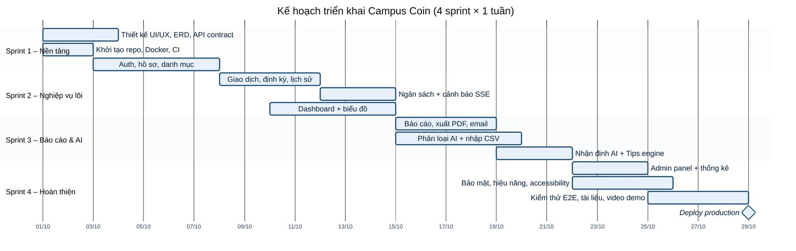

# 12. CHIẾN LƯỢC KIỂM THỬ

## 12.1 Các cấp kiểm thử và công cụ

***Bảng 67: Các cấp kiểm thử***

| **Cấp**          | **Phạm vi**                                                                              | **Công cụ**                                    | **Mục tiêu**                                               |
|------------------|------------------------------------------------------------------------------------------|------------------------------------------------|------------------------------------------------------------|
| Unit test        | Service, thuật toán tips, dự báo, phát hiện bất thường, chuẩn hóa merchant key, validate | Vitest                                         | Độ phủ ≥ 80% cho module nghiệp vụ                          |
| Integration test | API + DB thật (MySQL container), phân quyền, cross-tenant                                | Vitest + Supertest                             | Mọi endpoint có ít nhất 1 test thành công + 1 test từ chối |
| Component test   | Form giao dịch, bộ lọc, widget                                                           | React Testing Library                          | Hành vi chính của UI                                       |
| E2E test         | Luồng người dùng trọn vẹn trên trình duyệt                                               | Playwright (Chromium, Firefox, WebKit)         | 15 kịch bản chính xanh trước mỗi lần triển khai            |
| Accessibility    | Các trang chính                                                                          | axe-core + Lighthouse                          | 0 lỗi mức serious/critical                                 |
| Hiệu năng        | Dashboard, danh sách, tạo giao dịch                                                      | k6                                             | Đạt chỉ tiêu mục 10.1                                      |
| Bảo mật          | OWASP Top 10, header, cấu hình                                                           | OWASP ZAP, npm audit, Trivy, kiểm thử thủ công | 0 lỗ hổng High/Critical                                    |
| UAT              | Sinh viên thật dùng thử                                                                  | Kịch bản UAT, khảo sát                         | Nhập giao dịch đầu tiên \< 60 s với người mới              |

## 12.2 Test case tiêu biểu

***Bảng 68: Test case tiêu biểu***

| **Mã** | **Chức năng**  | **Kịch bản**                                      | **Kết quả mong đợi**                                       |
|--------|----------------|---------------------------------------------------|------------------------------------------------------------|
| TC-01  | Đăng ký        | Đăng ký email mới hợp lệ                          | 202; email xác minh gửi tới Mailpit; tài khoản pending     |
| TC-02  | Đăng ký        | Đăng ký email đã tồn tại                          | 202 với thông điệp chung giống TC-01 (không lộ email)      |
| TC-03  | Đăng nhập      | Sai mật khẩu 5 lần                                | Lần 6 bị khóa 15 phút, email cảnh báo, audit auth.locked   |
| TC-04  | Phiên          | Dùng lại refresh token cũ sau khi đã xoay vòng    | 401; toàn bộ phiên của family bị thu hồi                   |
| TC-05  | Reset mật khẩu | Dùng link reset lần 2 hoặc sau 30 phút            | Từ chối; yêu cầu gửi lại link                              |
| TC-06  | Phân quyền     | Sinh viên A GET/PATCH/DELETE giao dịch của B      | 404 cho cả ba thao tác, dữ liệu B không đổi                |
| TC-07  | Phân quyền     | Sinh viên gọi /admin/users                        | 403                                                        |
| TC-08  | Admin          | Đăng nhập admin với TOTP sai                      | 401; audit admin.mfa.failed                                |
| TC-09  | Danh mục       | Tạo danh mục trùng tên cùng loại                  | 409                                                        |
| TC-10  | Danh mục       | Xóa danh mục có giao dịch, chọn danh mục thay thế | Giao dịch chuyển sang danh mục mới trong 1 transaction     |
| TC-11  | Giao dịch      | Tạo chi tiêu số tiền 0 hoặc âm                    | 422 lỗi trường amount                                      |
| TC-12  | Giao dịch      | Hai tab cùng sửa một giao dịch                    | Tab lưu sau nhận 409 version-mismatch                      |
| TC-13  | Lịch sử        | Sửa rồi xóa giao dịch                             | History có 3 bản ghi create/update/delete; khôi phục được  |
| TC-14  | Định kỳ        | Rule hằng tháng ngày 31, chạy tháng 2             | Sinh giao dịch ngày 28/29; chạy job 2 lần không sinh trùng |
| TC-15  | AI             | Nhập "Campus Cafe" lần đầu (AI bật)               | Gợi ý Food, nhãn Gợi ý AI                                  |
| TC-16  | AI             | Sửa gợi ý sang Entertainment, nhập lại cùng mô tả | Lần sau gợi ý Entertainment (luật cá nhân, tin cậy ≥ 0,8)  |
| TC-17  | AI             | LLM timeout / khóa API sai                        | Giao dịch vẫn lưu được; không gợi ý; lỗi log ở server      |
| TC-18  | CSV            | File 3 MB hoặc file .exe đổi tên .csv             | 413 / 415, không lưu gì                                    |
| TC-19  | CSV            | Ô mô tả chứa "=HYPERLINK(...)", xuất lại CSV      | Ô được thêm tiền tố nháy đơn khi xuất                      |
| TC-20  | Ngân sách      | Chi làm tiêu thụ đạt 85% rồi 105%                 | 2 thông báo NEAR_LIMIT và EXCEEDED, mỗi loại 1 lần         |
| TC-21  | Báo cáo        | Xuất PDF tháng có tiếng Việt                      | PDF hiển thị đúng dấu, số liệu khớp báo cáo trên màn hình  |
| TC-22  | Nhận định      | Food tăng 40% so với TB 3 tháng                   | Nhận định flag Food +40%, có lời khuyên hạn mức tuần       |
| TC-23  | Tips           | Dismiss một tip                                   | Tip không xuất hiện lại trong 30 ngày                      |
| TC-24  | Bất thường     | Chi 500 USD ở danh mục thường ~10 USD             | Giao dịch bị gắn cờ is_anomaly, thông báo xác nhận         |
| TC-25  | Trùng lặp      | Tạo 2 giao dịch giống hệt trong 2 phút            | Giao dịch thứ 2 gắn cờ nghi trùng                          |
| TC-26  | XSS            | Mô tả chứa thẻ script                             | Hiển thị như văn bản, không thực thi                       |
| TC-27  | Giao diện      | Bật dark mode, cỡ chữ 130%, màn hình 375px        | Không vỡ bố cục, tương phản đạt AA                         |
| TC-28  | Rate limit     | Gọi /auth/forgot-password 4 lần/giờ               | Lần 4 nhận 429 kèm Retry-After                             |

## 12.3 Dữ liệu kiểm thử

SRS yêu cầu trình bày dữ liệu kiểm thử sử dụng. Bộ dữ liệu được sinh bằng script seed có tham số cố định (deterministic) để kết quả tái lập được:

***Bảng 69: Bộ dữ liệu kiểm thử***

| **Bộ dữ liệu**            | **Nội dung**                                                                         | **Mục đích**                               |
|---------------------------|--------------------------------------------------------------------------------------|--------------------------------------------|
| Hồ sơ "An" (chi tiêu đều) | 6 tháng, ~90 giao dịch/tháng; trợ cấp 300 USD/tháng; ngân sách Food 90, Transport 30 | Kiểm thử dashboard, báo cáo, dự báo        |
| Hồ sơ "Bình" (biến động)  | 3 tháng; tháng cuối Food tăng 40%, Entertainment tăng 60%; 4 gói subscription        | Kiểm thử nhận định, tips R2/R4             |
| Hồ sơ "Chi" (người mới)   | Không có giao dịch                                                                   | Onboarding, trạng thái rỗng, nhập CSV      |
| File CSV hợp lệ           | 200 dòng, 3 định dạng ngày, mô tả song ngữ                                           | Nhập và phân loại hàng loạt                |
| File CSV lỗi              | Dòng thiếu cột, số tiền chữ, ngày sai, ô chứa công thức, dòng trùng                  | Kiểm tra validate và báo cáo lỗi           |
| Mô tả phân loại           | 100 mô tả có nhãn đúng (Campus Cafe→Food, Grab→Transport, Netflix→Subscriptions…)    | Đo độ chính xác phân loại (mục tiêu ≥ 85%) |
| Dữ liệu tải               | 5.000 người dùng × 12 tháng × 80 giao dịch (~4,8 triệu bản ghi)                      | Kiểm thử hiệu năng, chỉ mục                |

## 12.4 Tiêu chí hoàn thành (Definition of Done)

- Chức năng đáp ứng tiêu chí chấp nhận và có mặt trong ma trận truy vết (Phụ lục A).

- Unit/integration test viết kèm và pass; không giảm độ phủ; E2E liên quan pass.

- Code review bởi ít nhất 1 thành viên; lint và type-check sạch; không có cảnh báo bảo mật mới.

- Giao diện responsive, đạt kiểm tra accessibility, có trạng thái loading/empty/error.

- Tài liệu (TDD, OpenAPI, README) được cập nhật.

# 13. KẾ HOẠCH TRIỂN KHAI DỰ ÁN

## 13.1 Lộ trình

Kế hoạch tham khảo gồm 4 sprint × 1 tuần; ngày cụ thể điều chỉnh theo lịch cuộc thi.

***Hình 29: Kế hoạch triển khai theo sprint***

***Bảng 70: Mục tiêu từng sprint***

| **Sprint**        | **Mục tiêu**                                                                                      | **Sản phẩm bàn giao**                              |
|-------------------|---------------------------------------------------------------------------------------------------|----------------------------------------------------|
| 1 – Nền tảng      | Thiết kế UI/ERD/API, hạ tầng dev, CI, xác thực, hồ sơ, danh mục                                   | Đăng ký/đăng nhập/reset hoạt động, CI xanh         |
| 2 – Nghiệp vụ lõi | Giao dịch, định kỳ, lịch sử, ngân sách, cảnh báo, dashboard                                       | Người dùng ghi và xem chi tiêu, cảnh báo ngân sách |
| 3 – Báo cáo & AI  | Báo cáo, xuất PDF, email, phân loại AI, nhập CSV, nhận định, tips                                 | Toàn bộ chức năng AI và báo cáo                    |
| 4 – Hoàn thiện    | Admin, trí tuệ hệ thống, accessibility, bảo mật, hiệu năng, E2E, tài liệu, video demo, triển khai | Bản production + gói nộp theo SRS 1.9              |

## 13.2 Rủi ro và biện pháp giảm thiểu

***Bảng 71: Rủi ro dự án***

| **Rủi ro**                                  | **Khả năng** | **Ảnh hưởng** | **Giảm thiểu**                                                                                       |
|---------------------------------------------|--------------|---------------|------------------------------------------------------------------------------------------------------|
| Nhà cung cấp LLM lỗi, đổi giá hoặc giới hạn | Trung bình   | Trung bình    | AI Adapter đa nhà cung cấp, fallback quy tắc/template, cache, quota                                  |
| Lộ dữ liệu tài chính người dùng             | Thấp         | Rất cao       | Chương 9: phân quyền sở hữu, mã hóa, test cross-tenant, ZAP, audit                                   |
| Chậm tiến độ do phạm vi rộng                | Cao          | Cao           | Ưu tiên chức năng bắt buộc của SRS trước; tính năng mở rộng (OCR, forecast) sau; sprint ngắn có demo |
| Hiệu năng báo cáo giảm khi dữ liệu lớn      | Trung bình   | Trung bình    | Chỉ mục, cache, bảng tổng hợp, k6 kiểm thử sớm                                                       |
| Mất dữ liệu do sự cố máy chủ                | Thấp         | Cao           | Backup hằng ngày + binlog, lưu khác vùng, kiểm thử khôi phục hằng tháng                              |
| Gợi ý AI sai gây khó chịu                   | Trung bình   | Thấp          | Luôn cho ghi đè, học từ sửa đổi, hiển thị độ tin cậy, đo tỷ lệ chấp nhận                             |
| Vi phạm quy định sử dụng AI của cuộc thi    | Trung bình   | Cao           | AI chỉ hỗ trợ; nhóm tự hiểu và giải thích được mọi quyết định; khai báo công cụ AI (Phụ lục D)       |
